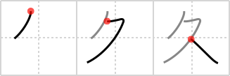

## `long time`

## [3]

## Reading:

### On-Yomi: キュウ、ク &mdash; Kun-Yomi: ひさ.しい

## Heisig story:

This character uses the diagonal sweep of the second stroke to double up for <i>bound up</i> and a <i>person</i>. Think of a mummy, and the key word will not be far behind.

## Koohii stories:

1) [<a href="http://kanji.koohii.com/profile/dingomick">dingomick</a>] 26-2-2007(225): Note: this is the ひさ in ひさしぶり .<strong> Long time</strong> no see <em>mummy</em>! (A bound up person).

2) [<a href="http://kanji.koohii.com/profile/gorgon">gorgon</a>] 2-3-2006(33): This is a picture of a person bowing &quot;long time no see!&quot;.

3) [<a href="http://kanji.koohii.com/profile/Delina">Delina</a>] 13-5-2008(22): Be careful if you&#039;re using alternate primitives for this kanji! There are only three strokes, and the stroke order is similar to <em>bound up</em> with an extra &#039;leg&#039; like the last stroke of <em>person</em>. Using <em>recline</em> and <em>person</em> would give you four strokes. Using <em>drop</em> and <em>enter</em> would give the wrong stroke order and the wrong shape in handwritten kanji, even though they all look kind of the same in print. See <a href="http://www.mahou.org/Kanji/3557/">http://www.mahou.org/Kanji/3557/</a> (bottom of page) for the handwritten style.

4) [<a href="http://kanji.koohii.com/profile/Artemisk">Artemisk</a>] 19-3-2009(21): That <em>bound up</em> <em>person</em> is a <em>mummy</em>, he&#039;s been that way for a<strong> long time</strong>.

5) [<a href="http://kanji.koohii.com/profile/kansaigaijin">kansaigaijin</a>] 28-7-2009(13): A mummy is a <em>person</em> who has been <em>bound up</em> for a <strong>long time</strong>.

6) [<a href="http://kanji.koohii.com/profile/amillerchip">amillerchip</a>] 30-9-2011(4): This is probably etymologically wrong, but this looks like a fusion of the katakana　ク and ス. So I imagine two people Ku and Su that finally meet each other after such a<strong> long time</strong> that they embrace to form one.

7) [<a href="http://kanji.koohii.com/profile/nesert">nesert</a>] 27-6-2010(4): Hey ク-T (Ku + T = cutie), it&#039;s been a<strong> long time</strong>!

8) [<a href="http://kanji.koohii.com/profile/kakashi">kakashi</a>] 18-7-2011(3): Mummies are <em>people</em> that are <em>bound up</em> for a<strong> long time</strong>.

9) [<a href="http://kanji.koohii.com/profile/d3rwolf">d3rwolf</a>] 22-7-2009(3): BOUND UP PERSON (i.e. hooker bound to the bed or something in thailand) saying--- me love you<strong> long time</strong>.

10) [<a href="http://kanji.koohii.com/profile/KanjiHantaa">KanjiHantaa</a>] 4-6-2013(2): <strong>Duradero</strong> es el <em>empaquetado</em> de las <em>personas</em> perecidas transformadas en <em>momias</em>.
