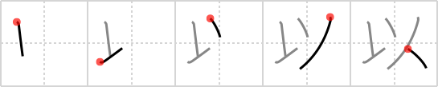

# {以}

## Strokes: 5

## Reading:

### On-Yomi: イ &mdash; Kun-Yomi: もっ.て

## Words:

以て(もって): with, by, by means of, because, in view of

以外(いがい): except for, other than

以後(いご): from now on, thereafter

以降(いこう): on and after, hereafter, thereafter

以前(いぜん): ago, since, before, previous

以来(いらい): since, henceforth

以下(いか): ~ or less than?not more than

以上(いじょう): more than, over

以内(いない): within
