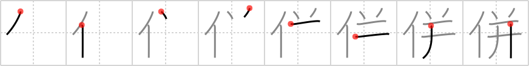

## {1030}

## `join`

## [8]

## Reading:

### On-Yomi: ヘイ &mdash; Kun-Yomi: あわ.せる

### Examples: 併せる (あわ.せる)

## Words:

合併(がっぺい): combination, union, amalgamation, consolidation, merger, coalition, fusion, annexation, affiliation, incorporation
