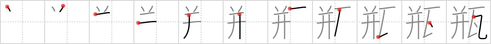

## {1032}

## `flower pot`

## [11]

## Reading:

### On-Yomi: ビン &mdash; Kun-Yomi: かめ

## Words:

瓶(かめ): earthenware pot

瓶(びん): bottle, vase, vial

瓶詰(びんづめ): bottling, bottled

花瓶(かびん): (flower) vase
