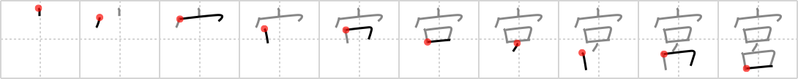

## `Shinto shrine`

## [10]

## Reading:

### On-Yomi: キュウ、グウ、ク、クウ &mdash; Kun-Yomi: みや

### Examples: 宮殿 (きゅうでん), 宮廷 (きゅうてい), 離宮 (りきゅう), 宮 (みや)

## Words:

お宮(おみや): Shinto shrine

宮殿(きゅうでん): palace

## Koohii stories:

1) [<a href="http://kanji.koohii.com/profile/Raichu">Raichu</a>] 27-6-2006(242): A friend of mine made up a rhyme for this one: &quot;house with a spine,<strong> Shinto shrine</strong>&quot;! 

2) [<a href="http://kanji.koohii.com/profile/fuaburisu">fuaburisu</a>] 8-1-2006(163): This<strong> Shinto shrine</strong> is built with human <em>spines</em>. Have you ever seen the ossuary in Sedlec, near Kutna Hora in Czech Republic ? It is a small church entirely decorated with human bones. Do a web search for &quot;sedlec ossuary&quot;, it&#039;s quite a sight. 

3) [<a href="http://kanji.koohii.com/profile/smithsonian">smithsonian</a>] 18-2-2007(101): The <em>house</em> that serves as the <em>backbone</em> of Japanese religion is the<strong> Shinto shrine</strong>. 

4) [<a href="http://kanji.koohii.com/profile/samueruht">samueruht</a>] 22-1-2008(24): Fact: Most of the traditional japanese Shinto families have a small<strong> Shinto shrine</strong> (kamidana) in their homes. Is very important for them; The<strong> Shinto shrine</strong> is really the <em>spine of the house</em>. <a href="http://en.wikipedia.org/wiki/Kamidana">http://en.wikipedia.org/wiki/Kamidana</a>. 

5) [<a href="http://kanji.koohii.com/profile/MisterM2402">MisterM2402</a>] 4-2-2011(11): A friend of mine made up this rhyme: &quot;<em>house with a spine</em>,<strong> Shinto shrine</strong>&quot;! (Now Raichu&#039;s whole story rhymes :D). 

6) [<a href="http://kanji.koohii.com/profile/libsrone">libsrone</a>] 31-12-2010(7): Buddhist shrines are for wusses. You want a house with some backbone, go to a<strong> Shinto shrine</strong>. 

7) [<a href="http://kanji.koohii.com/profile/j0k0m0">j0k0m0</a>] 2-3-2011(6): HOUSE OF SPINE - a<strong> Shinto shrine</strong>! (Omiya　  <a href="http://jisho.org/kanji/details/大宮">大宮</a>   just north of Tokyo. 

8) [<a href="http://kanji.koohii.com/profile/tritonxg">tritonxg</a>] 6-1-2010(5): [FR]sanctuaire japlt:N1 <strong>KYÛ KU GÛ miya </strong>kk721<em> toît+épine dorsale</em> <strong>MIYAJIMA :</strong> ce SANCTUAIRE est sacré pour les japonais car son TOIT constitue l&#039;EPINE DORSALE du shintoïsme avec Ise et izumo  <a href="http://jisho.org/kanji/details/宮家">宮家</a>  【みやけ】prince residence   <a href="http://jisho.org/kanji/details/宮崎県">宮崎県</a>  【みやざきけん】  <a href="http://jisho.org/kanji/details/宮参り">宮参り</a>  【みやまいり】 shrine visit  <a href="http://jisho.org/kanji/details/宮内庁">宮内庁</a>  【くないちょう】Imperial Household Agency  <a href="http://jisho.org/kanji/details/バチカン宮殿">バチカン宮殿</a>  【バチカンきゅうでん】Vatican  <a href="http://jisho.org/kanji/details/子宮">子宮</a>  【しきゅう】uterus  <a href="http://jisho.org/kanji/details/迷宮">迷宮</a>  【めいきゅう】mystery;labyrinth. 

9) [<a href="http://kanji.koohii.com/profile/PepeSeco">PepeSeco</a>] 8-9-2010(4): If you <strong>sh...into</strong> the <strong>shrine</strong> // they&#039;ll sent you <em>home</em> with a broken <em>spine</em>. 

10) [<a href="http://kanji.koohii.com/profile/tinonet">tinonet</a>] 20-12-2009(4): Under<strong> Shinto shrine</strong>&#039;s <em>roof</em> you can see people praying with their <em>spines</em> bent. 
