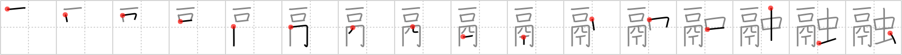

## `dissolve`

## [16]

## Reading:

### On-Yomi: ユウ &mdash; Kun-Yomi: と.ける、と.かす

## Words:

融資(ゆうし): financing, loan

融通(ゆうずう): lending (money), accommodation, adaptability, versatility, finance

金融(きんゆう): monetary circulation, credit situation

## Koohii stories:

1) [<a href="http://kanji.koohii.com/profile/zenkun">zenkun</a>] 13-3-2006(653): I have created the element &quot;old camera&quot; out of the left side of the kanji: from the subject&#039;s point of view, the light is captured by <em>one</em> <em>mouth</em> (the lens). The photographer is under a big <em>hood</em>, we only see his <em>legs</em>, and he is holding a <em>spike</em> in his right hand, which is the shutter release. Now, at the time the photographer takes the photo, a little <em>insect</em> is flying near the flash. The flash is so powerful that the insect is burnt and<strong> dissolve</strong>s in the air. 

2) [<a href="http://kanji.koohii.com/profile/amthomas">amthomas</a>] 21-3-2007(97): I&#039;ve seen this crazy thing with only <em>one mouth</em> that can<strong> dissolve</strong> up to <em>4 nails</em> and an <em>insect</em> at the same time. Sweet! (It&#039;s a venus flytrap, btw). 

3) [<a href="http://kanji.koohii.com/profile/decals">decals</a>] 27-11-2008(42): Just one single mouthful of cola has enough acidic power to<strong> dissolve</strong> 4 nails and one large live insect! Gross! (Not actually true, but meh...). 

4) [<a href="http://kanji.koohii.com/profile/xiaoma">xiaoma</a>] 29-9-2009(28): 鬲 is a &quot;reki&quot; <a href="http://images.google.com/images?oe=utf-8&amp;q=%E9%AC%B2">http://images.google.com/images?oe=utf-8&amp;q=%E9%AC%B2</a> Its <em>mouth</em> faces the <em>ceiling</em>, it&#039;s hooded, and it&#039;s got three legs. My magical <em>reki</em> has 2 <em>animal legs</em> in front and a <em>spike</em> in the back. It can <em>dissolve</em> any <em>insect</em> that dares pass between its mouth and the ceiling. My reki can also<strong> dissolve</strong> website designers who <em>bug</em> it by not allowing HTML links. 

5) [<a href="http://kanji.koohii.com/profile/Immacolata">Immacolata</a>] 24-10-2005(24): <strong>Dissolve</strong> (fuse, liquefied by heat) a man is welding a large hole in the <em>ceiling</em>. He sees his wife&#039;s <em>mouth</em> yelling at him from the floor above, but he can&#039;t hear her from inside the welding <em>helmet</em>. He steps back with his tiny <em>legs</em> onto a <em>nail</em> (ouch), all while a huge nasty stinging <em>insect</em> gets into his helmet. This guy is just having one of those days. :) <em>(This one is an abridged version of Fuaburisu, but I posted it because this kanji is so damn hard to remember by a story)</em>. 

6) [<a href="http://kanji.koohii.com/profile/AndamanIslander">AndamanIslander</a>] 5-5-2008(20): 鬲 is an arcane Kanji meaning <em>three-legged steamer.</em> It has <em>one</em> <em>mouth/opening</em> on top (in the <em>hood</em> where the steam comes out) and three legs: two <em> human legs</em> and a third leg that&#039;s just a <em>spike</em>. To<strong> dissolve</strong> a <em>bug</em> just dunk it into the <em>three-legged steamer</em>. 

7) [<a href="http://kanji.koohii.com/profile/jmadsen">jmadsen</a>] 26-1-2006(18): The left side of this kaji is <em>reki</em>, a traditional 3-legged steamer (to steam food in). I don&#039;t have a <em>steamer</em> story yet, but for now .... How do you make &quot;bug juice&quot;? Put <em>insects</em> in the <em>steamer</em> until they<strong> dissolve</strong>. ----- <em>Steamer</em> is also used in Kanji 1312, &quot;isolate&quot;----- jeff. 

8) [<a href="http://kanji.koohii.com/profile/torida">torida</a>] 26-5-2010(9): 鬲 is a &quot;reki&quot; or <em>steamer</em> — Its <em>mouth</em> faces the <em>ceiling</em>, its lower half often forms a <em>hood</em> with three legs, which can be decorated. My steamer has a lower hood decorated with 2 <em>human legs</em> in front and a <em>spike</em> in the back. .............................................................. The steam it produces will <em>dissolve</em> any <em>insect</em> that dares pass by. .............................................. <a href="http://images.google.com/images?oe=utf-8&amp;q=%E9%AC%B2">http://images.google.com/images?oe=utf-8&amp;q=%E9%AC%B2</a> [thanks xiaoma]. 

9) [<a href="http://kanji.koohii.com/profile/uberclimber">uberclimber</a>] 25-5-2010(8): This is a graphic representation of a murder victim&#039;s corpse <strong>dissolv</strong>ing under the <em>floor</em>. The <em>mouth</em> is still recogniseable, as are the <em>human legs</em> which are still wrapped in the victim&#039;s <em>hood</em>ie. The murder weapon, a <em>spike</em>, is still embedded in the corpse. Lots of <em>insects</em> are buzzing around having a feeding frenzy.   <a href="http://jisho.org/kanji/details/融資">融資</a>   ゆうし financing, loan. 

10) [<a href="http://kanji.koohii.com/profile/thatkidpercy">thatkidpercy</a>] 25-8-2008(7): (鬲 れき： The old Chinese teapot that holds just enough to provide <em>one mouth</em> with <em>four</em> sips of <em>tea (T)</em>) In ancient China, people would catch <em>insects</em> that flew into the house using their <em>鬲（れき）</em> as once inside, the insect would<strong> DISSOLVE</strong> into nothing, saving the trouble of having to throw it outside, as you would if you&#039;d used a normal cup. 
