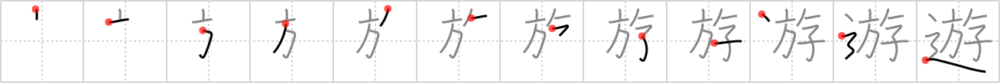

## `play`

## [12]

## Reading:

### On-Yomi: ユウ、ユ &mdash; Kun-Yomi: あそ.ぶ、あそ.ばす

## Heisig story:

Banners . . . children . . . road.

## Koohii stories:

1) [<a href="http://kanji.koohii.com/profile/ruuku35">ruuku35</a>] 7-4-2007(283): The BANNER warns that CHILDREN<strong> PLAY</strong> on the ROAD.

2) [<a href="http://kanji.koohii.com/profile/CharleyGarrett">CharleyGarrett</a>] 19-2-2007(50): There is always a stupid <strong>banner</strong> talking about <strong>children</strong> at <em>play</em> near the <strong>road</strong>. They mean &quot;drive slowly&quot;, but it sounds like its slow(stupid) <strong>children</strong> that are at <em>play</em>.

3) [<a href="http://kanji.koohii.com/profile/FarisB">FarisB</a>] 9-6-2009(38): No matter how many times we told them these CHILDREN keep<strong> PLAY</strong>ing in the middle of the road, so we put up a new BANNER: &quot;RUN EM DOWN&quot;, that scared the hell out of them... what? why are you looking at me like that?

4) [<a href="http://kanji.koohii.com/profile/scottamus">scottamus</a>] 8-11-2005(20): A <em>banner</em> hangs over the <em>road</em> saying &quot;watch out for <em>children</em> at<strong> play</strong>&quot;.

5) [<a href="http://kanji.koohii.com/profile/xxinde">xxinde</a>] 30-3-2010(8): Seeing how drivers ignore the <em>road</em> signs that warn about<strong> play</strong>ng children, the parents took matters in their own hands by making the kids wear bright <em>banners</em> on their backs, much like Japanese medieval soldiers (<a href="http://en.wikipedia.org/wiki/Sashimono">http://en.wikipedia.org/wiki/Sashimono</a>).

6) [<a href="http://kanji.koohii.com/profile/Alunalun">Alunalun</a>] 19-7-2009(5): The <em>children</em> are <strong>playing</strong> in the <em>road</em>. This obviously isn&#039;t that safe, even on a quiet road, so their parents have given them <em>banners</em> to carry and make them more visible. They&#039;re also quite fun to wave around. ^_^.

7) [<a href="http://kanji.koohii.com/profile/akrodha">akrodha</a>] 17-12-2006(4): Drivers have overlooked the tiny &quot;Caution! Children <strong>playing</strong>!&quot; road signs so often, that concerned parents put up large, dazzling banners to protect their children. Imagine driving into one of these streets and immediately noticing these large banners telling you to slow down.

8) [<a href="http://kanji.koohii.com/profile/shuusaku">shuusaku</a>] 9-8-2009(3): On the ROAD, the CHILDREN<strong> PLAY</strong> with the BANNER (like smal kites).

9) [<a href="http://kanji.koohii.com/profile/Spidercat">Spidercat</a>] 6-1-2009(3): The only time children may<strong> play</strong> on the road is when there is a fair, then they are allowed to<strong> play</strong> under the fair banners.

10) [<a href="http://kanji.koohii.com/profile/dwhitman">dwhitman</a>] 10-1-2008(3): The BANNER warns that CHILDREN<strong> PLAY</strong> on the ROAD. I have a little trouble with the positioning of the primitives, wanting to make banner the enclosure instead of road. The key idea here is that kids are<strong> play</strong>ing in the ROAD, so road gets the dominant left/enclosing position.
