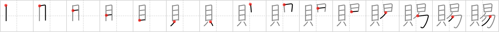

## `grant`

## [15]

## Reading:

### On-Yomi: シ &mdash; Kun-Yomi: たまわ.る、たま.う、たも.う

### Examples: 賜る (たまわ.る)

## Words:

賜る(たまわる): to grant, to bestow

## Koohii stories:

1) [<a href="http://kanji.koohii.com/profile/dingomick">dingomick</a>] 29-12-2006(284): A<strong> grant</strong> is <em>easy money</em>. 

2) [<a href="http://kanji.koohii.com/profile/smithsonian">smithsonian</a>] 21-2-2007(57): Do you want free <em>shells</em> from the government? It&#039;s <em>easy</em> with my new book, &quot;How to Get a Free<strong> Grant</strong> from the Government!&quot; Call today! 

3) [<a href="http://kanji.koohii.com/profile/fuaburisu">fuaburisu</a>] 18-10-2005(28): This<strong> grant</strong> is <em>shells</em> (money) that were awarded to you, or that someone &quot;deigned to give&quot; to you (another kanji meaning). Regardless, they are &quot;<em>easy shells</em>&quot; because you won&#039;t have to return them, and you didn&#039;t have to work for them! -- &quot;grant is <em>easy shells</em>&quot;. 

4) [<a href="http://kanji.koohii.com/profile/kanjihito">kanjihito</a>] 10-6-2010(16): A<strong> grant</strong> may seem like easy money, but then the kanji would be out of order. So you must justify the<strong> grant</strong> <em>money</em> first, then it will be <em>easy</em>. 

5) [<a href="http://kanji.koohii.com/profile/crystalcastlecreature">crystalcastlecreature</a>] 17-12-2008(8): MONEY that&#039;s EASY is a<strong> GRANT</strong>. 

6) [<a href="http://kanji.koohii.com/profile/Stormchild">Stormchild</a>] 19-7-2006(7): If I could get the government to<strong> grant</strong> me some <em>shells</em> (a scholarship), it would make it a lot <em>easier</em> to pay for school. 

7) [<a href="http://kanji.koohii.com/profile/DrJones">DrJones</a>] 6-1-2008(4): The giant clam <strong>grants</strong> you its pearl, so it makes <em>easy</em> for you to open its <em>shell</em>. What a lucky person! 

8) [<a href="http://kanji.koohii.com/profile/dinmamma">dinmamma</a>] 17-8-2009(3): A<strong> grant</strong> = <em>clams</em> which makes life <em>easier</em> [this order.]. 

9) [<a href="http://kanji.koohii.com/profile/kiwiburner">kiwiburner</a>] 12-9-2012(2): Graduate students see a<strong> grant</strong> as <em>money</em> that they can get <em>easy</em> - just write some stupid paper. 

10) [<a href="http://kanji.koohii.com/profile/KanjiVirtuoso">KanjiVirtuoso</a>] 6-10-2011(2): When you&#039;re Hugh<strong> Grant</strong>, <em>money</em> comes <em>easy</em>. 
