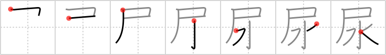

## `urine`

## [7]

## Reading:

### On-Yomi: ニョウ

## Heisig V6:

Flag . . . water.

## Premitive V4:

flag The pictographic representation of this element is obvious. Provided you can hold your imagination in check for the first example, you might best imagine your own national flag in composing your stories. [3]

## Koohii stories:

1) [<a href="http://kanji.koohii.com/profile/DrJones">DrJones</a>] 5-1-2008(237): Animals use their<strong> urine</strong> to mark their territory. So for them, their body <em>water</em> works as a <em>flag</em> denoting their &quot;country&quot; (<em>why bother? we all know which story you are going to pick</em>).

2) [<a href="http://kanji.koohii.com/profile/chamcham">chamcham</a>] 15-9-2006(128): Someone is pissing on the American flag, but since the<strong> urine</strong> is clear it looks like water.

3) [<a href="http://kanji.koohii.com/profile/Shibo">Shibo</a>] 23-5-2008(80): The flag primitive looks like a big &quot;P&quot;. And, let&#039;s face it,<strong> urine</strong> is just pee water. So, &quot;Urine = <em>P Water</em>&quot;. Yes, it&#039;s stupid, but I don&#039;t think I&#039;m gonna forget it now, haha. (I renamed the flag primitive &quot;pee&quot;, it makes for unforgettable stories).

4) [<a href="http://kanji.koohii.com/profile/samuize">samuize</a>] 27-7-2007(30): Animals use<strong> urine</strong> as a &quot;watery flag&quot;.

5) [<a href="http://kanji.koohii.com/profile/dshill99">dshill99</a>] 20-8-2008(22): <strong>Urine</strong> is <em>water</em> that <em>flags</em> your territory.

6) [<a href="http://kanji.koohii.com/profile/taijuando">taijuando</a>] 29-12-2006(15): In New York there was a controversial art piece consisting of an <em>American flag</em> soaked in<strong> urine</strong>... Rudolf Guliani wanted to ban it but I just think it is <em>watered</em> down art.

7) [<a href="http://kanji.koohii.com/profile/Nisshawn">Nisshawn</a>] 8-11-2009(9): P water is<strong> urine</strong>.

8) [<a href="http://kanji.koohii.com/profile/Codexus">Codexus</a>] 29-12-2007(6): The primitive placement here is important. So it&#039;s about peeing _under_ the <em>national flag</em>. Think of some patriotic guy who every morning raises the flag and then <em>waters</em> the area under it.

9) [<a href="http://kanji.koohii.com/profile/jonusbalonus">jonusbalonus</a>] 13-5-2013(4): <strong>Urine</strong> is used by animals to <em>flag</em> an area as belonging to them, that is, their territory. This kanji shows<strong> urine</strong> being used to <em>flag</em> a particularly important piece of territory, the <em>water</em>ing hole. Just how important it is, is highlighted by having the <em>flag</em> over the full <em>water</em> kanji, rather than just using the <em>water</em> primitive.

10) [<a href="http://kanji.koohii.com/profile/KeshaFran">KeshaFran</a>] 29-11-2010(4): Animals <em>flag</em> their territory by <em>watering</em> a spot with their<strong> urine</strong>.
