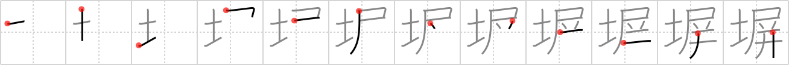

## `fence`

## [12]

## Reading:

### On-Yomi: ヘイ、ベイ

## Heisig V6:

Soil . . . flag . . . puzzle.

## Koohii stories:

1) [<a href="http://kanji.koohii.com/profile/Ricardo">Ricardo</a>] 27-10-2006(235): [fence; wall; (kokuji)] A <strong>fence</strong> separates one <em>soil</em> from the other. On a large scale, large pieces of <em>soil</em>s in the world have a virtual <strong>fence</strong> called nation. Picture a world map where all countries have their <em>soil</em> with one color, their national <em>flag</em> as the legend and a <strong>fence</strong> on the borders... don&#039;t you think it looks like a giant <em>puzzle</em>?

2) [<a href="http://kanji.koohii.com/profile/samuize">samuize</a>] 27-7-2007(96): Why the Earth has to be<strong> fence</strong>d off and flags used to represent each &quot;country&quot; is a puzzle to me - we&#039;re all just monkeys on a big rock spinning round the Sun!

3) [<a href="http://kanji.koohii.com/profile/adhmm">adhmm</a>] 19-5-2008(34): An Ikea<strong> fence</strong>: you want to seperate your soil from your neighbor&#039;s, so you go buy an Ikea<strong> fence</strong>. You start putting it together and it&#039;s like a puzzle, with little flags on top of each post.

4) [<a href="http://kanji.koohii.com/profile/esaulgd">esaulgd</a>] 3-10-2007(28): What is the best way to <strong>fence</strong> this <em>soil</em>? If we mark possible locations with <em>flags</em> it may be easier to solve this <em>puzzle</em>.

5) [<a href="http://kanji.koohii.com/profile/Virtua_Leaf">Virtua_Leaf</a>] 11-10-2009(26): The <em>Earth</em> is<strong> fence</strong>d off with <em>flags</em> indicating different countries, forming a complex <em>puzzle</em> of lands. (thanks samuize).

6) [<a href="http://kanji.koohii.com/profile/Shibo">Shibo</a>] 13-5-2008(20): My friend is lying on the <em>ground</em> in agony. I told him not to <em>pee</em> on the electric<strong> fence</strong> and he did anyway. He <em>puzzles</em> me.. (Note: I use &quot;pee&quot; for the &quot;flag&quot; primitive).

7) [<a href="http://kanji.koohii.com/profile/sethg">sethg</a>] 22-4-2009(11): A<strong> fence</strong> separates two pieces of <em>soil</em> flying two different <em>flags</em>, and the borders fit together like pieces of a <em>puzzle</em>.

8) [<a href="http://kanji.koohii.com/profile/childofthetao">childofthetao</a>] 9-6-2010(6): Into the <em>dirt</em> I stick a <a href="../2223">folding screen</a> (#2223 屏) 屏 to us as a<strong> fence</strong>.

9) [<a href="http://kanji.koohii.com/profile/daredawg3583">daredawg3583</a>] 3-4-2008(6): Why is the US so intent on building a<strong> fence</strong> separating their soil from Mexican soil? (picture each respective FLAG on each side.) Getting across the<strong> fence</strong> isn&#039;t exactly a <em>puzzle</em>...

10) [<a href="http://kanji.koohii.com/profile/Perry">Perry</a>] 15-4-2010(5): I was PUZZLED when I found my English FLAG, SOILED and hanging from the<strong> FENCE</strong>. Then I found out my neighbour doesn&#039;t like Gaijin.
