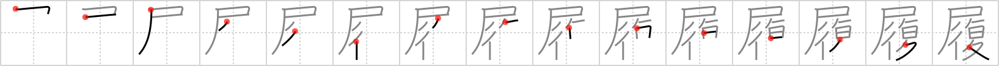

## `footgear`

## [15]

## Reading:

### On-Yomi: リ &mdash; Kun-Yomi: は.く

### Examples: 履く (は.く)

## Words:

履く(はく): to wear, to put on (lower body)

履歴(りれき): personal history, background, career, log

草履(ぞうり): sandals

## Koohii stories:

1) [<a href="http://kanji.koohii.com/profile/Perry">Perry</a>] 10-4-2009(206): NOTE: The most common use is in はく, meaning to put on<strong> footgear</strong>, rather than actual<strong> footgear</strong> itself. STORY: You are asleep in camp when you are woken up with news that the FLAG has fallen to the enemy. You quickly PUT ON YOUR<strong> FOOTGEAR</strong> and run off to RESTORE the FLAG. 

2) [<a href="http://kanji.koohii.com/profile/mspertus">mspertus</a>] 21-9-2006(105): You should never use a <em>flag</em> as a shoeshine cloth to <em>restore</em> your<strong> footgear</strong>. 

3) [<a href="http://kanji.koohii.com/profile/Immacolata">Immacolata</a>] 2-2-2006(76): The flag has fallen! To win the flag must be restored. Whomever has to run up on the hill to restore the flag needs good<strong> footgear</strong>. 

4) [<a href="http://kanji.koohii.com/profile/chamcham">chamcham</a>] 4-1-2010(16): After being embarassed at the olympics, the national track team wants to restore honor to their flag. So they hire Nike to create ultra futuristic<strong> footgear</strong> (think Michael Johnson&#039;s gold running shoes). 

5) [<a href="http://kanji.koohii.com/profile/Shibo">Shibo</a>] 13-5-2008(13): My friend&#039;s<strong> footgear</strong> had lost its shine after constant wear. He was drunk and all of a suddent got a &quot;brilliant&quot; idea to <em>restore</em> that &quot;wet look&quot; to his<strong> footgear</strong>. Yup, he <em>peed</em> all over them. Gotta love drunken ideas. ( I use &quot;pee&quot; for the &quot;flag&quot; primitive). 

6) [<a href="http://kanji.koohii.com/profile/ziggr">ziggr</a>] 28-12-2006(11): US Marines wore good <strong>footgear</strong> (combat boots!) as they <em>restored</em> the <em>flag</em> on Iwo Jima. —— Avoid <a href="../1057">footgear</a> (#1057 <a href="http://jisho.org/kanji/details/履">履</a>), <a href="../1894">shoes</a> (#1894 <a href="http://jisho.org/kanji/details/靴">靴</a>). 

7) [<a href="http://kanji.koohii.com/profile/xxinde">xxinde</a>] 30-3-2010(10): You&#039;re playing a FPS (I think of Unreal Tournament) in Capture the Flag mode. Your <em>flag</em> is captured by the enemy team, so you pick up some<strong> footgear</strong> that allows you to jump really high and <em>restore</em> it in a matter of seconds. 

8) [<a href="http://kanji.koohii.com/profile/kuraujiokun">kuraujiokun</a>] 10-7-2009(7): I was playing Final Fantasy Tactics and once saw an accessories shop with a <em>[flag]</em> announcing a new kind of <strong>footgeat</strong> that <em>[restores]</em> HP when you move. 

9) [<a href="http://kanji.koohii.com/profile/kalin">kalin</a>] 21-8-2008(6): You see a big <em>flag</em> marking the save point to <em>restore</em> your party at. While you are there, you try on the new<strong> footgear</strong> you picked up from the last boss. Auto-regen (<em>restore</em>)<strong> footgear</strong>! Awesome! 

10) [<a href="http://kanji.koohii.com/profile/Meconium">Meconium</a>] 25-5-2009(5): Playing an RPG, you encounter an enemy who <em>pees</em> on your<strong> footgear</strong>. This is the ultimate ignominy in this game, so when no-one&#039;s looking you quietly <em>restore</em> to the point where you last saved your game. 
