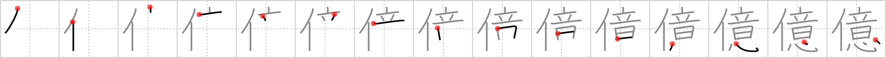

## `hundred million`

## [15]

## Reading:

### On-Yomi: オク

## Heisig story:

Person . . . idea.

## Koohii stories:

1) [<a href="http://kanji.koohii.com/profile/the_marshal">the_marshal</a>] 13-6-2006(158): Mr. T has an clear idea of what he would do if he ever got<strong> hundred million</strong> dollar. (I guess it would be a enormous gold chain !).

2) [<a href="http://kanji.koohii.com/profile/smithsonian">smithsonian</a>] 9-4-2007(44): <em>Mr. T&#039;s</em> bright <em>idea</em> is to get a<strong> hundred million</strong> kids to vow not to use drugs. &quot;C&#039;mon, foo! Sign the paper!&quot;.

3) [<a href="http://kanji.koohii.com/profile/DrJones">DrJones</a>] 31-12-2007(20): A representative of the United States Mint has come up with the <em>idea</em> of using <em>Chuck Norris</em>&#039; face for a<strong> hundred million</strong> dollars bill. According to experts, one<strong> hundred million</strong> dollars is the worth estimate for any one of Chuck&#039;s ideas.

4) [<a href="http://kanji.koohii.com/profile/crystalcastlecreature">crystalcastlecreature</a>] 13-8-2008(16): A PERSON with a good IDEA will make a<strong> hundred million</strong> dollars.

5) [<a href="http://kanji.koohii.com/profile/Jonathan">Jonathan</a>] 22-6-2008(10): An <em>idea</em> from a <em>Jedi</em> is worth a<strong> hundred million</strong> non-<em>Jedi</em> ideas.

6) [<a href="http://kanji.koohii.com/profile/Verdana">Verdana</a>] 4-6-2009(9): <em>Khatzumoto</em> always says to learn 1 0000 sentences, but then he had a better <em>idea</em>. Why not learn 1 0000 0000 (hundred million) sentences instead?! :D.

7) [<a href="http://kanji.koohii.com/profile/uberclimber">uberclimber</a>] 9-10-2010(8): George Lucas&#039; <em>Jedi idea</em> netted him a<strong> hundred million</strong> dollars. Bastard. 億 おくa<strong> hundred million</strong>.

8) [<a href="http://kanji.koohii.com/profile/mantixen">mantixen</a>] 27-9-2008(5): <em>Haruhi</em> always has a<strong> hundred million</strong> <em>ideas</em> for her club.

9) [<a href="http://kanji.koohii.com/profile/Viking101">Viking101</a>] 3-1-2010(4): <em>Dwight Schrute</em> calls up corporate and tells David that he has an <em>idea</em> to save one<strong> hundred million</strong> dollars, but he can only tell David in person. After David drives all the way to Scranton, Dwight yells &quot;April Fools!&quot;.

10) [<a href="http://kanji.koohii.com/profile/vanirra">vanirra</a>] 2-12-2009(4): One <em>person</em> with a bright <em>idea</em> can gather a<strong> hundred million</strong> followers. ie, Ghandi.
