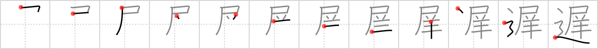

## `slow`

## [12]

## Reading:

### On-Yomi: チ &mdash; Kun-Yomi: おく.れる、おく.らす、おそ.い

## Heisig V6:

Flag . . . sheep . . . road.

## Koohii stories:

1) [<a href="http://kanji.koohii.com/profile/dingomick">dingomick</a>] 23-8-2007(223): A <em>sheep</em> crossing guard waves a <strong>SLOW</strong> flag for his fellow <em>sheep</em> crossing the <em>road</em>.

2) [<a href="http://kanji.koohii.com/profile/RoboTact">RoboTact</a>] 16-4-2007(127): <em>Road</em> sign (<em>flag</em>): &quot;<em>Sheep</em> on highway! Drive <strong>slowly</strong>.&quot;.

3) [<a href="http://kanji.koohii.com/profile/yukkuri_kame">yukkuri_kame</a>] 17-6-2009(15): I was driving down the ROAD and I had to PEE, but the road was blocked by a flock of SHEEP moving really<strong> SLOW</strong>LY. You can&#039;t imagine how<strong> SLOW</strong> SHEEP can be until you have a full bladder. Finally, I put the car in park in the middle of the ROAD and got out real<strong> SLOW</strong> and PEED on the SHEEP.

4) [<a href="http://kanji.koohii.com/profile/radical_tyro">radical_tyro</a>] 19-6-2007(8): The traffic controller raises a <em>flag</em> that says<strong> SLOW</strong> while the <em>sheep</em> cross the <em>road</em>. (don&#039;t confuse with <a href="../1060">yield</a> (#1060 屈)).

5) [<a href="http://kanji.koohii.com/profile/sumomi">sumomi</a>] 16-3-2009(6): Eine Herde Schafe überquert die Straße, und irgendwann zieht auch das letzte <em>Schaf</em>, jenes mit der <em>Fahne</em> des Schäfers um den Hals über eben jene <em>Landstraße</em>. Und wir wissen, jetzt können wir endlich weiter fahren. Dummerweise werden wir ob dieses Ereignisses unseren Termin wohl <strong>verspätet</strong> erreichen.

6) [<a href="http://kanji.koohii.com/profile/crystalcastlecreature">crystalcastlecreature</a>] 17-12-2008(6): As you&#039;re driving you encounter a FLAG that reads, SHEEP CROSSING ROAD so drive<strong> SLOW</strong> biznatch! Then lil&#039; jon comes out and says, &quot;YEEEEYAAH~!&quot;.

7) [<a href="http://kanji.koohii.com/profile/Shibo">Shibo</a>] 14-5-2008(5): Yep, the neighbor&#039;s kid is<strong> slow</strong>. He&#039;s drinking from the puddle of <em>sheep pee</em> in the <em>road</em>. (Note: I use &quot;pee&quot; for the &quot;flag&quot; primitive).

8) [<a href="http://kanji.koohii.com/profile/AndamanIslander">AndamanIslander</a>] 5-5-2008(5): You&#039;re on the <em>road</em> and see a big <em>flag</em> that says, &quot;slow, <em>sheep</em> crossing. Immediately you think to yourself, &quot;damnit, if I go this<strong> slow</strong> I&#039;m going to be <strong>late</strong>.&quot; (<strong>Late</strong> being the more usual meaning of this kanji.).

9) [<a href="http://kanji.koohii.com/profile/henroski">henroski</a>] 3-8-2006(5): In NZ when you are out driving in the rural areas. it is not uncommon to see SHEEP being herded along the ROAD between farms. At these times there is usually a farmers kid waving a bright orange FLAG warning you to<strong> SLOW</strong> down.

10) [<a href="http://kanji.koohii.com/profile/uberclimber">uberclimber</a>] 27-3-2011(4): Go<strong> slow</strong> (スピードダウン!)...that signal <em>flag</em> means there are <em>sheep</em> on the <em>road</em> ahead. 遅れる おくれる be late for, be delayed, be far behind; 遅刻する ちこくする be late, be tardy; 遅い おそい late,<strong> slow</strong>.
