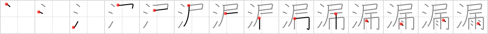

## {1068}

## `leak`

## [14]

## Reading:

### On-Yomi: ロウ &mdash; Kun-Yomi: も.る、も.れる、も.らす

### Examples: 漏らす (も.らす), 漏る (も.る), 漏れる (も.れる)

## Words:

漏らす(もらす): to let leak, to reveal

漏る(もる): to leak, to run out

漏れる(もれる): to leak out, to escape, to come through, to shine through, to filter out, to be omitted
