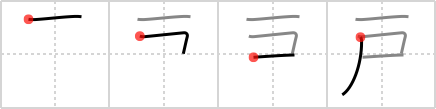

## `door`

## [4]

## Reading:

### On-Yomi: コ &mdash; Kun-Yomi: と

### Examples: 戸 (と)

## Words:

戸(こ): counter for houses

戸籍(こせき): census, family register

戸締り(とじまり): closing up, fastening the doors

雨戸(あまど): (sliding) storm door

井戸(いど): water well

瀬戸物(せともの): earthenware, crockery, china

戸棚(とだな): cupboard, locker, closet, wardrobe

戸(と): door (Japanese style)

## Koohii stories:

1) [<a href="http://kanji.koohii.com/profile/matticus">matticus</a>] 10-12-2005(272): Traditional Japanese storefront<strong> door</strong>s have several <em>flags</em>, known as &quot;noren,&quot; hanging down from a curtain rod in front of them. I see this as a pseudo-pictograph, and use the horizontal line across the top to represent the curtain rod, since noren don&#039;t usually hang from the <em>ceiling</em>. 

2) [<a href="http://kanji.koohii.com/profile/dingomick">dingomick</a>] 30-12-2006(37): A Japanese<strong> door</strong> has a noren, a <em>flag</em> hanging from a <em>rod</em>. (I give this primitive the meaning of a noren-covered<strong> door</strong>). 

3) [<a href="http://kanji.koohii.com/profile/ruuku35">ruuku35</a>] 17-5-2006(25): Their is only ONE FLAG on<strong> DOOR</strong>s in Japan. The Japanese FLAG of course! 

4) [<a href="http://kanji.koohii.com/profile/b0ng0">b0ng0</a>] 29-1-2009(17): If you are too poor to afford a<strong> door</strong>, you can just hang a <em>single flag</em> instead. 

5) [<a href="http://kanji.koohii.com/profile/Shibo">Shibo</a>] 14-5-2008(11): I was standing in my bathroom <em>pee</em>ing when there was a loud knock on the<strong> door</strong>. It scared me so badly that I fell backwards and <em>pee</em>d on the <em>ceiling</em>. What can I say, I got some strong <em>pee</em> muscles.. (Note: I use &quot;pee&quot; for the &quot;flag&quot; primitive). 

6) [<a href="http://kanji.koohii.com/profile/tritonxg">tritonxg</a>] 7-1-2010(5): [FR]porte N2 <strong>KO to </strong>k&amp;k:152<em> plafond+drapeau</em> <strong>porte-avions :</strong> quand le PLAFOND est dégagé on agite un DRAPEAU sur le pont pour autoriser le décollage   <a href="http://jisho.org/kanji/details/戸">戸</a>  【こ】counter for houses  <a href="http://jisho.org/kanji/details/戸を立てる">戸を立てる</a>  【とをたてる】shut a<strong> door</strong>   <a href="http://jisho.org/kanji/details/戸主">戸主</a>  【こしゅ】head of a household  <a href="http://jisho.org/kanji/details/戸籍">戸籍</a>  【こせき】census  <a href="http://jisho.org/kanji/details/井戸">井戸</a>  【いど】well  <a href="http://jisho.org/kanji/details/引き戸">引き戸</a>  【ひきど】sliding<strong> door</strong>下戸【げこ】non-drinker  <a href="http://jisho.org/kanji/details/怒り上戸">怒り上戸</a>  【おこりじょうご】quarrelsome drinker  <a href="http://jisho.org/kanji/details/江戸っ子">江戸っ子</a>  【えどっこ】Tokyoite  <a href="http://jisho.org/kanji/details/木戸">木戸</a>  【きど】wooden<strong> door</strong>. 

7) [<a href="http://kanji.koohii.com/profile/shuusaku">shuusaku</a>] 10-8-2009(5): The first type of<strong> DOOR</strong> in HISTORY has been a FLAG hanging from the CEILING. 

8) [<a href="http://kanji.koohii.com/profile/altaya">altaya</a>] 13-6-2011(3): You can make an improvised<strong> door</strong> by hanging a flag from the ceiling. Won&#039;t keep anyone out, but at least gives you some privacy. 

9) [<a href="http://kanji.koohii.com/profile/abdul">abdul</a>] 6-4-2011(3): En Japón, en muchas <strong>puertas</strong> ponen <em>banderas</em> colgando, del <em>techo</em> (se llaman のれん). Como en las tiendas de   <a href="http://jisho.org/kanji/details/そば、美味しい！">そば、美味しい！</a>  . <a href="http://upload.wikimedia.org/wikipedia/commons/2/25/Fabric_shop_in_Nara.jpg">http://upload.wikimedia.org/wikipedia/commons/2/25/Fabric_shop_in_Nara.jpg</a>. 

10) [<a href="http://kanji.koohii.com/profile/Nijuro">Nijuro</a>] 8-7-2010(2): Would it kill you to install <em>one</em><strong> door</strong> instead of making me drape a <em>flag</em> over the entrance? 
