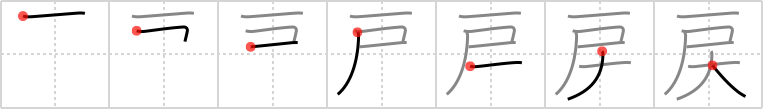

## `re-`

## [7]

## Reading:

### On-Yomi: レイ &mdash; Kun-Yomi: もど.す、もど.る

### Examples: 戻す (もど.す), 戻る (もど.る)

## Words:

取り戻す(とりもどす): to take back, to regain

払い戻す(はらいもどす): repay, pay back

戻す(もどす): restore, put back, return

戻る(もどる): return

## Koohii stories:

1) [<a href="http://kanji.koohii.com/profile/Matthew">Matthew</a>] 11-7-2006(222): The <em>St. Bernard dog</em> whining at the <em>door</em> of his master’s house in order to<strong> re-</strong>enter /<strong> re-</strong>turn inside. 

2) [<a href="http://kanji.koohii.com/profile/thermal">thermal</a>] 16-6-2008(140): This is common with cats, but also happens with dogs. They go out the door. 5 minutes later they change their minds and come back in. They<strong> re-</strong>go out the door. They<strong> re-</strong>come back in. They<strong> re-</strong>go out the door. They<strong> re-</strong>come back in. They<strong> re-</strong>go out the door. They<strong> re-</strong>come back in. They<strong> re-</strong>go out the door. They<strong> re-</strong>come back in. They<strong> re-</strong>go out the door. They<strong> re-</strong>come back in. They<strong> re-</strong>go out the door. They<strong> re-</strong>come back in. They<strong> re-</strong>go out the door. AAAAAARRRRRGGGHHHH!!! 

3) [<a href="http://kanji.koohii.com/profile/wasurenaide">wasurenaide</a>] 16-11-2007(78): Think about hachiko, the <em>dog</em> waiting at the <em>door</em> of the station, waiting for his master to <em>re-</em>turn. 

4) [<a href="http://kanji.koohii.com/profile/RobMow">RobMow</a>] 16-9-2008(25): This story can help you remember this Kanji as well as the next frame <a href="../1082">tears</a> (#1082 <a href="http://jisho.org/kanji/details/涙">涙</a>). When the <em>lost dog</em><strong> re-</strong>turned to his master&#039;s <em>doorstep</em>, the two<strong> re-</strong>joiced at their happy<strong> re-</strong>union. 

5) [<a href="http://kanji.koohii.com/profile/unauthorized">unauthorized</a>] 12-11-2009(17): Hint: This is the kanji used in the verb   <a href="http://jisho.org/kanji/details/戻る">戻る</a>  [もどる] which means &quot;to return, to turn back&quot;. I suggest using &quot;turn back&quot; as keyword, which is far easier to remember compared to the abstract &quot;re-&quot;. Do not confuse with <a href="../725">return</a> (#725 <a href="http://jisho.org/kanji/details/返">返</a>) which has the meaning of the verb かえる - to return, to come back. 

6) [<a href="http://kanji.koohii.com/profile/chamcham">chamcham</a>] 9-1-2010(14): Another who ever waits in the Shibuya section of Tokyo knows about Hachiko, the dog who would <em>return</em> to the station for its master. Even after master died, the <em>dog</em> would wait for him at the station <em>door</em> and continued to do so for 10 years until it died. 

7) [<a href="http://kanji.koohii.com/profile/nac_est">nac_est</a>] 24-7-2007(8): I want to<strong> re-</strong>live all my beautiful memories of my <em>St. Bernard dog</em>, but they&#039;re gone forever since he walked out the <em>door</em> and left me for another master. 

8) [<a href="http://kanji.koohii.com/profile/ruuku35">ruuku35</a>] 25-3-2007(8): I had to<strong> RE-</strong>align the DOOR because the St BERNARD got stuck under it. 

9) [<a href="http://kanji.koohii.com/profile/PepeSeco">PepeSeco</a>] 5-4-2008(7): As in music, <strong>re</strong>peat after me: &quot;<strong>re-</strong>re-re...&quot; --&gt; &quot;<em>door</em>-re-mi-fa-sol-la-si-<em>dog</em>&quot;. 

10) [<a href="http://kanji.koohii.com/profile/BobDG">BobDG</a>] 1-11-2010(6): <strong>Re-</strong>do the door. It&#039;s too big. 
