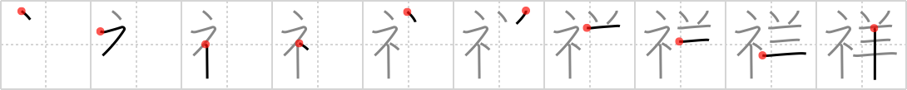

## `auspicious`

## [10]

## Reading:

### On-Yomi: ショウ &mdash; Kun-Yomi: さいわ.い、きざ.し、よ.い、つまび.らか

## Koohii stories:

1) [<a href="http://kanji.koohii.com/profile/Johnnyltn">Johnnyltn</a>] 13-9-2006(189): Bringing a <em>sheep</em> to sacrifice on the <em>altar</em> was a sign of an<strong> auspicious</strong> life. The poor could only afford a pigeon, the more<strong> auspicious</strong> an expensive <em>sheep</em> for an offering. 

2) [<a href="http://kanji.koohii.com/profile/ziggr">ziggr</a>] 24-5-2007(73): On this <strong>ewe-spicious</strong> occasion, you sacrifice a <em>sheep</em> at the <em>altar</em>. —— Sorry, but I really need more than generic altar sacrifices to connect keywords to stories. Sometimes an egregious pun is the only way. 

3) [<a href="http://kanji.koohii.com/profile/akrodha">akrodha</a>] 16-3-2007(57): Once a year, the people pray for a sign from the gods. If the gods are pleased, they send down a <em>sheep</em> to the <em>altar</em>. The people see this as an<strong> auspicious</strong> gift; the wool and milk from this sheep is considered holy. But the gods think of it as a witty joke, since it&#039;s just a metaphor for the people following ancient rituals like blind sheep. Continued in <a href="../1291">calamity</a> (#1291 <a href="http://jisho.org/kanji/details/禍">禍</a>). 

4) [<a href="http://kanji.koohii.com/profile/nest0r">nest0r</a>] 13-2-2008(29): It&#039;s an<strong> auspicious</strong> sign when you go to the <em>altar</em> and the <em>sheep</em> is already beside it, ready to go. 

5) [<a href="http://kanji.koohii.com/profile/cbogart">cbogart</a>] 18-1-2007(23): <strong>Auspicious</strong> (adj): contraction of &quot;Australia&quot; and &quot;delicious&quot;; a sheep is placed on an &quot;australian altar&quot;, or &quot;barbie&quot;, on an<strong> auspicious</strong> occasion to celebrate. 

6) [<a href="http://kanji.koohii.com/profile/Harrow">Harrow</a>] 12-1-2009(17): Abraham found it highly<strong> auspicious</strong> when he spotted a sheep beside the altar. That meant he got to keep his son Isaac alive. 

7) [<a href="http://kanji.koohii.com/profile/eri401">eri401</a>] 23-5-2011(10): Abraham was asked to kill Isaac on the altar to <a href="../1086">show</a> (#1086 <a href="http://jisho.org/kanji/details/示">示</a>) his faith. Just then, a <em>sheep</em> appeared and saved Isaac. What an<strong> auspicious</strong> sign of God&#039;s favor! ----alternative story: after saluting the fellow Fishhook cult members, you place a sheep on the altar to celebrate the<strong> auspicious</strong> meeting.   <a href="http://jisho.org/kanji/details/健祥">健祥</a>  =けんしょう =spirit; pep; energy. 

8) [<a href="http://kanji.koohii.com/profile/Splatted">Splatted</a>] 26-11-2010(6): Upon seeing the <em>altar</em> the <em>sheep</em> realises the festival may be less<strong> auspicious</strong> than it first seemed. 

9) [<a href="http://kanji.koohii.com/profile/astridtops">astridtops</a>] 3-1-2007(5): The ancient Greek sacrificed a <em>sheep</em> on their <em>altar</em> to the gods for an<strong> auspicious</strong> beginning of the Trojan war. 

10) [<a href="http://kanji.koohii.com/profile/uberclimber">uberclimber</a>] 19-11-2010(4): Searching for<strong> auspicious</strong> omens, the shaman sacrificed a <em>sheep</em> on the <em>altar</em> and examined the entrails.   <a href="http://jisho.org/kanji/details/祥月">祥月</a>   しょうつき month of a person&#039;s death. 
