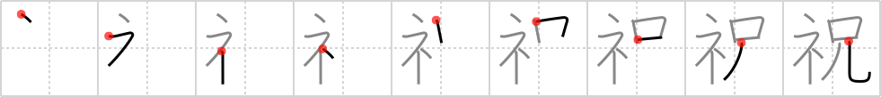

## `celebrate`

## [9]

## Reading:

### On-Yomi: シュク、シュウ &mdash; Kun-Yomi: いわ.う

## Heisig story:

Altar . . . teenager.

## Koohii stories:

1) [<a href="http://kanji.koohii.com/profile/SammyB">SammyB</a>] 2-8-2008(218): When Japanese people turn 20 they usually visit the <em>altar</em> at their local shrine and<strong> celebrate</strong> no longer being a <em>teenager</em>.

2) [<a href="http://kanji.koohii.com/profile/Stormchild">Stormchild</a>] 19-11-2006(134): It&#039;s a Bar Mitzvah. At the <em>altar</em>, the <em>teenager</em> is singing in his awful, mid-puberty voice. We&#039;ll all<strong> celebrate</strong> when that part is over!

3) [<a href="http://kanji.koohii.com/profile/radical_tyro">radical_tyro</a>] 19-6-2007(22): <em>Teenagers</em> <strong>celebrating</strong> at the church <em>altar</em>. (Maybe they just finished RTK).

4) [<a href="http://kanji.koohii.com/profile/joxn_costello">joxn_costello</a>] 3-1-2009(15): This <em>teenager</em> is at the <em>altar</em>, about to<strong> celebrate</strong> the sacrament of Confirmation.

5) [<a href="http://kanji.koohii.com/profile/sir_sanuk">sir_sanuk</a>] 9-1-2011(13): Coming of Age Day ( 成人の日 , seijin no hi) is a Japanese holiday held annually on the second Monday of January to<strong> celebrate</strong> those who have turned 20 years old. In this kanji we see someone going to the <em>altar</em> to<strong> celebrate</strong> no longer being a <em>teenager</em>.

6) [<a href="http://kanji.koohii.com/profile/Zareon">Zareon</a>] 28-2-2007(8): Teenagers stepping up to a big altar to<strong> celebrate</strong> their coming of age.

7) [<a href="http://kanji.koohii.com/profile/mezbup">mezbup</a>] 24-5-2009(5): The teenagers<strong> celebrate</strong> by having a party in the church and getting wasted at the altar.

8) [<a href="http://kanji.koohii.com/profile/kakashi">kakashi</a>] 5-4-2012(4): Don&#039;t confuse with #<a href="../868">congratulations</a> (#868 賀). [Story from sir_sanuk:]Coming of Age Day ( 成人の日 , seijin no hi) is a Japanese holiday held annually on the second Monday of January to<strong> celebrate</strong> those who have turned 20 years old. In this kanji we see someone going to the <em>altar</em> to<strong> celebrate</strong> no longer being a <em>teenager</em>.

9) [<a href="http://kanji.koohii.com/profile/proagg">proagg</a>] 12-3-2009(4): Isaac<strong> celebrate</strong>d when God told him to remove from the <em>altar</em> his <em>teenager</em> -Gen 22:1-12 (this can also tie into <a href="../1088">auspicious</a> (#1088 祥)).

10) [<a href="http://kanji.koohii.com/profile/jameserb">jameserb</a>] 26-3-2008(4): My older brother, the altar boy, helps<strong> celebrate</strong> the mass.
