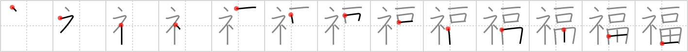

## `blessing`

## [13]

## Reading:

### On-Yomi: フク

## Heisig V6:

Altar . . . wealth.

## Koohii stories:

1) [<a href="http://kanji.koohii.com/profile/mspertus">mspertus</a>] 15-1-2007(224): This recalls the selling of indulgences in the history of the Church (As an aside, Protestantism began as a protest of this practice). Basically, one gave <em>wealth</em> to the <em>altar</em> (i.e. priest) and received a <em>blessing</em>. If you prefer a Jewish version, think of the donation (<em>wealth</em>) that is expected when you&#039;re called to the ark (<em>altar</em> in the kanji) to give a<strong> blessing</strong> over the torah.

2) [<a href="http://kanji.koohii.com/profile/radical_tyro">radical_tyro</a>] 19-6-2007(78): Put all your <em>wealth</em> on the church <em>altar</em> and receive one<strong> blessing</strong>. (You stand up out of your wheelchair or something.).

3) [<a href="http://kanji.koohii.com/profile/akaiYaMa">akaiYaMa</a>] 10-3-2009(52): Wow, this is Scientology put into a kanji. In the Scientology faith the <em>wealthiest</em> members have the highest status in the Church. So basically, the <em>wealthiest</em> person that puts the most money on the <em>alter</em> receives the most<strong> blessing</strong>s....(not really, from what I&#039;ve heard, the more money you give the better parking spot you get....).

4) [<a href="http://kanji.koohii.com/profile/RobMow">RobMow</a>] 8-9-2008(16): When you pray at the <em>altar</em> be sure to count your <em>wealth </em> as a<strong> blessing</strong>.

5) [<a href="http://kanji.koohii.com/profile/kadano">kadano</a>] 20-4-2009(11): This illustrates the idea of tithing... thankful for God&#039;s <strong>blessing</strong>s, you give back a tenth of the <em>wealth</em> He has given you at the <em>altar</em>.

6) [<a href="http://kanji.koohii.com/profile/DavidZ">DavidZ</a>] 31-8-2009(4): &quot;Count your <strong>ble$$ings</strong>.&quot; This suggests the medieval practice of buying an indulgence from the Church. You would walk up to the <em>altar</em> and place some of your <em>wealth</em> there, and in return would receive a<strong> blessing</strong>. (altar is on the left as always)... 福袋 [ふくぶくろ].

7) [<a href="http://kanji.koohii.com/profile/akahige">akahige</a>] 11-4-2009(4): All religions do this to an extent, and Japanese Buddhism is no exception. In some instances, it&#039;s one of the worst offenders. If a relative dies, you must go to the <strong>temple</strong> and pay a lot of your <strong>wealth</strong> to the priest, so that he will give your relative a<strong> blessing</strong>. What a con; this is why Japanese priests and monks are notoriously wealthy.

8) [<a href="http://kanji.koohii.com/profile/Artur83">Artur83</a>] 10-4-2009(4): Wer auf dem <em>Altar</em> all seinen <em>Reichtum</em> opfert, lebt zwar arm, aber mit Gottes <strong>Segen</strong>.

9) [<a href="http://kanji.koohii.com/profile/Shokkuno">Shokkuno</a>] 25-11-2012(3): &quot;The more the wealth you put in the altar, the more<strong> blessing</strong> God will give you&quot; said the evil priest.

10) [<a href="http://kanji.koohii.com/profile/tritonxg">tritonxg</a>] 28-4-2010(3): [FR]<strong>bonheur</strong> japlt:N2 <strong>FUKU </strong>k&amp;k:1379<em> autel+opulence </em><strong>7 dieux du bonheur : </strong>ils ont des AUTELS dans tous les sanctuaires car ils amènent l&#039;OPULENCE 七福神 【しちふくじん】shichifukujin 福 【ふく】good fortune 福引 【ふくびき】lottery 福岡県 【ふくおかけん】Fukuoka prefecture 福音教会 【ふくいんきょうかい】Evangelical Church 福祉 【ふくし】social security お多福 【おたふく】moon-faced woman 大福餅 【だいふくもち】 rice cake (sweet bean jam).
