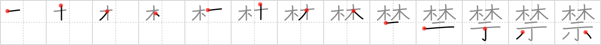

## `prohibition`

## [13]

## Reading:

### On-Yomi: キン

## Koohii stories:

1) [<a href="http://kanji.koohii.com/profile/snallygaster">snallygaster</a>] 26-9-2007(224): Similar to radical tyro&#039;s story. If you live in Japan, your main exposure to this kanji is probably &quot;no smoking&quot; signs. So I imagine the government enacting a<strong> prohibition</strong> of tobacco, and burning whole groves of tobacco plants on an altar (the altar of public health, or self-righteousness, if you will). 

2) [<a href="http://kanji.koohii.com/profile/Thunderball">Thunderball</a>] 7-8-2007(37): Hidden in a <em>grove</em> was a church with a secret <em>altar</em> that was stocked full of <strong>prohibited</strong> alcohol during the American<strong> prohibition</strong> period of 1920-1933. A local registered himself as a mininster of this <em>altar</em> so he could stock <strong>prohibited</strong> alcohol &quot;for sacremental purposes&quot; and share it with his <em>kin</em> (きん). 

3) [<a href="http://kanji.koohii.com/profile/genbaku">genbaku</a>] 13-1-2008(25): Placing trees on this alter is prohibited. 

4) [<a href="http://kanji.koohii.com/profile/Antunes">Antunes</a>] 21-12-2006(21): When Chirstianity was prohibited and the christians were being chased in Japan they had to hide their altars under the groves. 

5) [<a href="http://kanji.koohii.com/profile/harusame">harusame</a>] 29-5-2009(12): During<strong> prohibition</strong>, people drank hidden in <em>groves</em> so that they wouldn&#039;t be <em>shown</em> drinking in public. 

6) [<a href="http://kanji.koohii.com/profile/delbertmon">delbertmon</a>] 15-12-2009(7): You are prohibited from entering the grove because there is a sacred altar inside it. 

7) [<a href="http://kanji.koohii.com/profile/fuaburisu">fuaburisu</a>] 25-1-2006(6): There is this prohibited <em>altar</em>, outside of the church, hidden in a little <em>grove</em>. Crates of alcohol were hidden there during the &quot;prohibition&quot; (1920-1933 period in the United States). The local priest pretended they knew nothing about it... but would go pinch some alcohol at the prohibited &quot;<em>grove altar</em>&quot; when no one was watching. 

8) [<a href="http://kanji.koohii.com/profile/manubear">manubear</a>] 5-5-2012(5): This sign warns that entry to the <em>grove</em> is <strong>prohibited</strong> and if you ignore the warning, prepare to be sacrificed on the <em>altar</em> (  <a href="http://jisho.org/kanji/details/禁止">禁止</a>  ,   <a href="http://jisho.org/kanji/details/厳禁">厳禁</a>  ,   <a href="http://jisho.org/kanji/details/禁じる">禁じる</a>  ). 

9) [<a href="http://kanji.koohii.com/profile/Wosret">Wosret</a>] 26-2-2009(5): There is a<strong> prohibition</strong> on building <strong>alter</strong>s in this <strong>groove</strong>. 

10) [<a href="http://kanji.koohii.com/profile/ivoSF">ivoSF</a>] 21-12-2007(4): If you play a lot of rpg games you might think of this as an altar in a druids grove and of course its prohibited for those that defile nature. 
