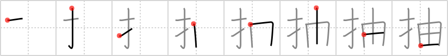

## `pluck`

## [8]

## Reading:

### On-Yomi: チュウ &mdash; Kun-Yomi: ひき-

## Words:

抽選(ちゅうせん): lottery, raffle, drawing (of lots)

抽象(ちゅうしょう): abstract

## Koohii stories:

1) [<a href="http://kanji.koohii.com/profile/Thora">Thora</a>] 8-9-2007(223): [When I see the word<strong> pluck</strong>, I think eyebrows, not vegetables. So, to avoid confusing with <a href="../733">pick</a> (#733 <a href="http://jisho.org/kanji/details/採">採</a>):] Each time this singular, long, wiry black hair starts to <em>sprout</em> out of my chin again, I<strong> pluck</strong> it with my <em>fingers</em>. 

2) [<a href="http://kanji.koohii.com/profile/Codexus">Codexus</a>] 25-12-2007(59): If you<strong> pluck</strong> your <em>fingers</em>, new ones will <em>sprout</em> in their place. (try it ;). 

3) [<a href="http://kanji.koohii.com/profile/phauna">phauna</a>] 14-2-2008(24): If you<strong> pluck</strong> hair from your eyebrows with your <em>fingers</em>, more hair will <em>sprout</em> in it&#039;s place. 

4) [<a href="http://kanji.koohii.com/profile/kanjihito">kanjihito</a>] 29-12-2012(19): <em>fingers</em><strong> pluck</strong> a single <em>sprout</em>. 

5) [<a href="http://kanji.koohii.com/profile/Samsara">Samsara</a>] 26-9-2008(13): Every time I see this kanji I think of the snapple commerical: &quot;White tea is a baby tea leaf, and while it still has a naturally light flavor.... we<strong> pluck</strong> it.&quot; <a href="http://www.youtube.com/watch?v=znAoCGATk8w">http://www.youtube.com/watch?v=znAoCGATk8w</a>. 

6) [<a href="http://kanji.koohii.com/profile/Tsuini">Tsuini</a>] 3-5-2012(6): DONT TRY CODEXUS&#039; STORY. IT DOESN&#039;T WORK. If you<strong> pluck</strong> your <em>fingers</em>, a new one does NOT <em>sprout</em> up in the same place. OH GOD SOMEONE CALL AN AMBULANCE. 

7) [<a href="http://kanji.koohii.com/profile/fuaburisu">fuaburisu</a>] 1-1-2006(6): <em>Shrek the ogre</em> (who is fond of delicious human finger snacks)<strong> pluck</strong>s human finger <em>seedlings</em> in his garden. Remember this kanji in tandem with &quot;push&quot; and &quot;insert&quot;. See &quot;sketch&quot; for more back-story about Shrek and the human finger seedlings. 

8) [<a href="http://kanji.koohii.com/profile/lilianasu">lilianasu</a>] 31-1-2012(4): Imagina que cuando te están <em>brotando</em> las muelas del juicio, el dentista decide extraerlas con los <em>dedos</em>... ouch! 

9) [<a href="http://kanji.koohii.com/profile/daredawg3583">daredawg3583</a>] 14-4-2008(4): [When I see the word<strong> pluck</strong>, I think eyebrows, not vegetables. So, to avoid confusing with <a href="../733">pick</a> (#733 <a href="http://jisho.org/kanji/details/採">採</a>):] <em>Brussel sprouts</em> started to appear aruond my eyebrows, so i took<strong> pluck</strong>ed them out with my <em>fingers</em> (thanks Thora). 

10) [<a href="http://kanji.koohii.com/profile/Viking101">Viking101</a>] 4-1-2010(3): <em>Wherefore</em>, art thou tweezers? <em>Romeo</em> had to<strong> pluck</strong> his unibrow before going to see Juliet. He couldn&#039;t find his tweezers so he used his <em>fingers</em> to<strong> pluck</strong> out the hair. 
