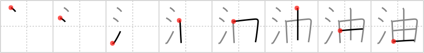

## {1107}

## `oil`

## [8]

## Reading:

### On-Yomi: ユ、ユウ &mdash; Kun-Yomi: あぶら

### Examples: 油 (あぶら)

## Words:

油絵(あぶらえ): oil painting

原油(げんゆ): crude oil

油(あぶら): oil

醤油(しょうゆ): soy sauce

石油(せきゆ): oil, petroleum, kerosene

灯油(とうゆ): lamp oil, kerosene

油断(ゆだん): negligence, unpreparedness
