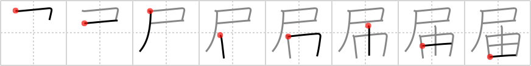

## `deliver`

## [8]

## Reading:

### On-Yomi: カイ &mdash; Kun-Yomi: とど.ける、-とど.け、とど.く

## Heisig V6:

Flag . . . sprout.

## Koohii stories:

1) [<a href="http://kanji.koohii.com/profile/Raichu">Raichu</a>] 14-4-2007(341): In the US, when the mail is<strong> deliver</strong>ed, a <em>flag</em> <em>sprouts</em> up on your mailbox. (We don&#039;t have that in Australia.).

2) [<a href="http://kanji.koohii.com/profile/torida">torida</a>] 3-4-2010(97): ***<em> Warning: Don&#039;t use a mailbox in this story, there&#039;s a primitive for that coming soon... </em>***.

3) [<a href="http://kanji.koohii.com/profile/fuaburisu">fuaburisu</a>] 27-1-2006(70): A Japanese man ordered some Brussel <em>sprouts</em> from Belgium. They are<strong> deliver</strong>ed with a little Belgian <em>flag</em> (as seen sometimes in shops, little flags indicating the provenance and authenticity of the food like cheese and meat).

4) [<a href="http://kanji.koohii.com/profile/burritokun">burritokun</a>] 15-10-2008(30): Just a note on Raichu&#039;s story, it&#039;s actually when you have mail <em>to</em><strong> deliver</strong> that the flag &quot;sprouts&quot; up (i.e. outgoing mail), it&#039;s not for incoming mail. The story still works, though..

5) [<a href="http://kanji.koohii.com/profile/Shibo">Shibo</a>] 16-5-2008(18): I tried to<strong> deliver</strong> a clear message to my girlfriend that said &quot;I don&#039;t like brussel <em>sprouts</em>&quot; by <em>peeing</em> on the bowl of them that she&#039;d just made. (Note: I use &quot;pee&quot; for the &quot;flag&quot; primitive).

6) [<a href="http://kanji.koohii.com/profile/kapalama">kapalama</a>] 11-3-2011(12): 届かない , 届け <a href="../1110">deliver</a> (#1110 届) (カイ) , とどく, とどける ... Parts: 尸, 由 ... Similar Keywords: 届ける <a href="../1110">deliver</a> (#1110 届), 配る <a href="../1436">distribute</a> (#1436 配) ... Note:<strong> Deliver</strong>,extended meaning of <strong>Reach</strong> (something reaching its destination, not of someone reaching for) with the extended meaning of<strong> Deliver</strong> coming from the potential form- <strong>can reach</strong> ... Story: When the <em>sprout</em> <strong>Reaches</strong> the <em>Flag</em> it is planted under, it is ready to be harvested and <strong>Delivered</strong>.

7) [<a href="http://kanji.koohii.com/profile/elmaestrokgb">elmaestrokgb</a>] 15-6-2009(12): Kiki has to<strong> deliver</strong> a bunch of alfalfa <em>sprouts</em> to the local hippies, but she can&#039;t find her regular broom, so she improvises by using an American <em>flag</em> on a pole.

8) [<a href="http://kanji.koohii.com/profile/thelooseteeth">thelooseteeth</a>] 6-3-2009(9): When you want to have a package <strong>delivered</strong>, make sure the little <em>flag</em> on your mailbox <em>sprouts</em> up to warn the mail man.

9) [<a href="http://kanji.koohii.com/profile/rtkrtk">rtkrtk</a>] 14-1-2008(8): Picture a guy riding around on a scooter with a bright flag mounted on the scooter. The flag says, &quot;sprouts express! we<strong> deliver</strong>!&quot; He comes up to your door and<strong> deliver</strong>s a bag of piping hot bean sprouts.

10) [<a href="http://kanji.koohii.com/profile/Artur83">Artur83</a>] 10-4-2009(7): Kam es früher in einer Stadt zu Aufruhr, wurde eine <em>Fahne</em> in dem jeweiligen Viertel gehisst, um die Verstärkung zu <strong>benachrichtigen</strong> und die Revolte im <em>Keim</em> zu ersticken.
