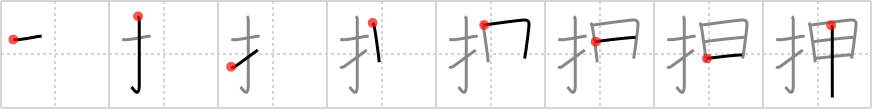

## `push`

## [8]

## Reading:

### On-Yomi: オウ &mdash; Kun-Yomi: お.す、お.し-、お.っ-、お.さえる、おさ.える

## Heisig V6:

<i>Fingers</i> . . . <i>roots</i>. Compare and contrast with <i>pluck</i> (Frame 1187).

## Koohii stories:

1) [<a href="http://kanji.koohii.com/profile/narafan">narafan</a>] 2-10-2007(154): <strong>Push</strong> the <em>roots</em> down, instead of plucking the seedling.

2) [<a href="http://kanji.koohii.com/profile/smithsonian">smithsonian</a>] 4-3-2007(100): Use your <em>fingers</em> to make sure the <em>roots</em> of your plant are deep underground by <strong>pushing</strong> them down, down, down.

3) [<a href="http://kanji.koohii.com/profile/Codexus">Codexus</a>] 26-12-2007(67): <strong>Push</strong> the button with your <em>finger</em> and get <em>root</em> beer!

4) [<a href="http://kanji.koohii.com/profile/claxton">claxton</a>] 25-7-2008(17): For those who liked the &quot;bird&#039;s eye view of the tank&quot; imagine a tank that has its tracks stuck in the sand. The big green machine is extremely hot from the desert sun as well as the heat its engine has created. With that picture in mind, this Kanji depicts what happens next when the soldiers get around the back of the tank and have to<strong> push</strong> it with their fingers because the surface is too hot for them to put their hands on.

5) [<a href="http://kanji.koohii.com/profile/dihutenosa">dihutenosa</a>] 10-5-2008(16): You are wearing your cool new <em>Ninja Turtles Shell Armour</em> and you realize that there&#039;s a little button with a <em>finger</em> symbol on it, inviting you to<strong> push</strong> it. You<strong> push</strong> it, and the front wall of the shell <strong>push</strong>es out violently. You&#039;ve learned a new attack - this isn&#039;t just a defense tool anymore, you can now run around and<strong> push</strong> people around for no reason! Cool!

6) [<a href="http://kanji.koohii.com/profile/tryllid">tryllid</a>] 13-8-2008(13): Fingers + Armor: Playing video games you<strong> push</strong> buttons with your <em>fingers</em> to attack the monsters and hope your <em>armor</em> is strong enough to outlast the encounter.

7) [<a href="http://kanji.koohii.com/profile/fuaburisu">fuaburisu</a>] 1-1-2006(8): <em>Shrek the ogre</em> (always fond of delicious human finger snacks)<strong> push</strong>es human finger <em>roots</em> in his garden. Contrast this with &quot;pluck&quot;, where the roots have grown into seedlings and are ready to be plucked. Also see &quot;insert&quot;.

8) [<a href="http://kanji.koohii.com/profile/wasurenaide">wasurenaide</a>] 24-11-2007(5): <strong>Push</strong> the button with your <em>finger</em> and a <em>ginseng root</em> tea will come out.

9) [<a href="http://kanji.koohii.com/profile/CharleyGarrett">CharleyGarrett</a>] 19-7-2007(5): <em>Fingers</em>, the thief, was robbing the museum. He would have gotten clean away with it too, but there was this row of <em>armor</em>. He couldn&#039;t resist <strong>push</strong>ing on the first one, and the domino effect alerted the guards.

10) [<a href="http://kanji.koohii.com/profile/jonusbalonus">jonusbalonus</a>] 19-5-2013(4): <strong>Push</strong> down gently, with your <em>fingers</em>, when planting anything so that the <em>roots</em> get the best possible chance to continue <em>pushing on downwards</em> by themselves.
