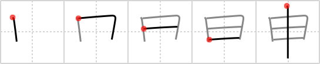

# {1117}

## `speaketh`

## [5]

## Reading:

### On-Yomi: シン &mdash; Kun-Yomi: もう.す、もう.し-、さる

### Examples: 申す (もう.す)

## Words:

申告(しんこく): report, statement, filing a return, notification

申し入れる(もうしいれる): to propose, to suggest

申し込み(もうしこみ): application, entry, request, subscription, offer, proposal, overture, challenge

申出(もうしで): proposal, request, claim, report, notice

申し出る(もうしでる): to report to, to tell, to suggest, to submit, to request, to make an offer, to come forward with information

申し分(もうしぶん): objection, shortcomings

申請(しんせい): application, request, petition

申し込む(もうしこむ): apply for, propose, offer, challenge, request

申し訳(もうしわけ): apology, excuse

申し訳ない(もうしわけない): inexcusable

申し上げる(もうしあげる): say (polite)

申す(もうす): say (polite)
