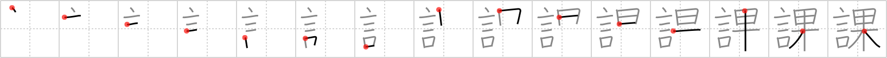

## {1123}

## `chapter`

## [15]

## Reading:

### On-Yomi: カ

## Words:

課外(かがい): extracurricular

課題(かだい): subject, theme, task

課(か): counter for chapters (of a book)

課税(かぜい): taxation

課程(かてい): course, curriculum

日課(にっか): daily lesson, daily work, daily routine
