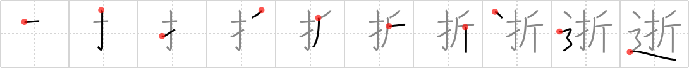

## `departed`

## [10]

## Reading:

### On-Yomi: セイ &mdash; Kun-Yomi: ゆ.く、い.く

## Heisig V6:

The connotation is of a &quot;dearly <b>departed</b>&quot; who has passed away. The elements: <i>fold</i> . . . <i>road</i>.

## Koohii stories:

1) [<a href="http://kanji.koohii.com/profile/Stormchild">Stormchild</a>] 11-4-2007(383): One of the dearest of Japan&#039;s dearly<strong> departed</strong> is Sasaki Sadako, who developed Leukemia after the bombing of Hiroshima, and became famous for <em>folding</em> more than a thousand paper cranes, never giving up hope. To this day, people in Hiroshima still <em>fold</em> origami cranes in her memory. For this character, let us imagine a parade in her honor, the entire <em>road</em> lined with <em>folded</em> cranes.

2) [<a href="http://kanji.koohii.com/profile/chamcham">chamcham</a>] 20-1-2008(46): The BIG ONE hits Tokyo. You see a news report of the recently<strong> departed</strong> victims who died when the <em>roads</em> <em>folded</em> (from the earthquake).

3) [<a href="http://kanji.koohii.com/profile/esaulgd">esaulgd</a>] 14-9-2007(26): The<strong> departed</strong> are those who have crossed that <em>fold</em> you cannot see past in the <em>road</em> we all walk.

4) [<a href="http://kanji.koohii.com/profile/adrianbarritt">adrianbarritt</a>] 14-3-2008(23): In the film The<strong> Departed</strong> a guy falls out of the window and ends up <em>folded</em> double on the <em>road</em> below.

5) [<a href="http://kanji.koohii.com/profile/Johnnyltn">Johnnyltn</a>] 21-8-2006(16): Picture the funeral procession of a great head of state (i.e. JFK) a dearly<strong> departed</strong> loved one to a nation. See his coffin drapped with the <em>folded</em> American flag as it is moved through the <em>roads</em> and streets of our nation&#039;s Capitol.

6) [<a href="http://kanji.koohii.com/profile/wilsonc">wilsonc</a>] 28-10-2008(15): You miss your flight and your plane has<strong> departed</strong> without you. No worries.. You fold a paper plane and use it to get on your way.

7) [<a href="http://kanji.koohii.com/profile/dmjudo">dmjudo</a>] 26-1-2011(9): We <em>folded</em> our map and<strong> departed</strong> on the <em>road</em>.

8) [<a href="http://kanji.koohii.com/profile/rtkrtk">rtkrtk</a>] 10-1-2008(9): Keep separate from <a href="../485">deceased</a> (#485 亡). Our dearly<strong> departed</strong> are taken away in a heavenly bus. &quot;<strong>Departure</strong> in ten minutes&quot; says the bus driver for the bus on the highway to heaven (the <em>road</em>). The bus drives down what appears to be a normal road, then FLASH, it disappears into a <em>fold</em> of space-time fabric separating our plane of existence from the heavens.

9) [<a href="http://kanji.koohii.com/profile/kusterdu">kusterdu</a>] 20-2-2008(7): You fold the kimono of the<strong> departed</strong> the opposite of how you fold your own kimono. This is to send him on the road to the next world.

10) [<a href="http://kanji.koohii.com/profile/aodeur">aodeur</a>] 15-4-2011(5): Wenn man auf der <em>Autobahn</em> ein zusammen<em>gefaltetes</em> Auto sieht, ist zu befürchten, dass bei diesem Unfall auch jemand <strong>ableben</strong> musste.
