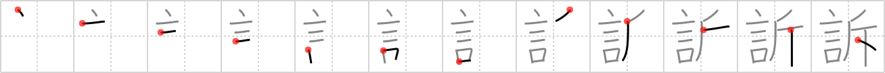

## `accusation`

## [12]

## Reading:

### On-Yomi: ソ &mdash; Kun-Yomi: うった.える

### Examples: 訴える (うった.える)

## Words:

訴え(うったえ): lawsuit, complaint

訴訟(そしょう): litigation, lawsuit

訴える(うったえる): sue (a person), resort to, appeal to

## Koohii stories:

1) [<a href="http://kanji.koohii.com/profile/joesan">joesan</a>] 23-10-2007(180): I strongly <em>reject</em> the<strong> accusation</strong> implicit in your <em>words</em>. 

2) [<a href="http://kanji.koohii.com/profile/Raichu">Raichu</a>] 10-11-2008(81): <em>Words</em> that make you feel <em>rejected</em>. 

3) [<a href="http://kanji.koohii.com/profile/szreter">szreter</a>] 14-6-2008(58): After murdering those who <em>reject</em>ed me with my blood-stained axe, I received a letter containing <em>words</em> of<strong> accusation</strong> from their families and the police. 

4) [<a href="http://kanji.koohii.com/profile/tristanthorn">tristanthorn</a>] 18-3-2009(42): <em>Words</em> of<strong> accusation</strong> are usually <em>rejected</em>, rarely accepted. 

5) [<a href="http://kanji.koohii.com/profile/fuaburisu">fuaburisu</a>] 25-10-2005(15): A mnemonic to put in image : &quot;The<strong> accusation</strong> <em>rejects</em> the <em>words</em> of the defendant&quot; . 

6) [<a href="http://kanji.koohii.com/profile/smithsonian">smithsonian</a>] 14-5-2007(14): The <em>words</em> of Ahmenidjad routinely <em>reject</em> the<strong> accusation</strong> that Iran has a nuclear weapons program. 

7) [<a href="http://kanji.koohii.com/profile/nest0r">nest0r</a>] 15-8-2008(10): <em>Words</em> of<strong> accusation</strong> don&#039;t bother me and I <em>reject</em> them, but if it&#039;s a <em>bloody </em><strong>axe-usation</strong>, that&#039;s something else! 

8) [<a href="http://kanji.koohii.com/profile/nac_est">nac_est</a>] 13-2-2008(7): Usually the <em>words</em> of<strong> accusation</strong> are <em>rejected</em> by the accused. 

9) [<a href="http://kanji.koohii.com/profile/dihutenosa">dihutenosa</a>] 11-5-2008(6): Seeing the <em>drop of</em> blood on his <em>axe</em> from the last frame, <em>Gilius Thunderhead of Golden Axe</em> makes an<strong> accusation</strong> to <em>Socrates</em> - &quot;You got this <em>drop</em> &#039;o blood on me <em>Golden Axe</em>, didn&#039;t ye?&quot;. <em>Socrates</em> looks nervous...&quot;No, you impudent dwarf. I <em>reject</em> your<strong> accusation</strong>&quot;. Is <em>Socrates</em> telling the truth? Has he kept up his <a href="../1133">vow</a> (#1133 <a href="http://jisho.org/kanji/details/誓">誓</a>)? Is the<strong> accusation</strong> true? Find out next episode... 

10) [<a href="http://kanji.koohii.com/profile/elmaestrokgb">elmaestrokgb</a>] 20-2-2010(3): In The Crucible, After Procter tells Abigail that he <em>rejects</em> her advances, she immediately gives her famous <em>speech</em>--the<strong> accusation</strong> that his wife is a witch. 
