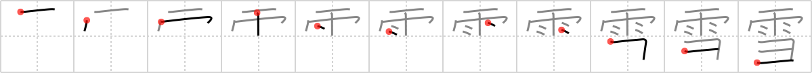

## `snow`

## [11]

## Reading:

### On-Yomi: セツ &mdash; Kun-Yomi: ゆき

## Heisig story:

<i>Rain</i> that undergoes a change so that it can be swept aside with a <i>broom</i> is <b>snow</b>.

## Premitive:

broom The pictographic representation here is of the bristles on the head of a broom. [3]

## Koohii stories:

1) [<a href="http://kanji.koohii.com/profile/BigAmish">BigAmish</a>] 15-8-2008(183): <strong>SNOW</strong> isn&#039;t all that different from <em>RAIN</em>, except it can be removed with a <em>BROOM</em> because it only forms in freezing temperatures.

2) [<a href="http://kanji.koohii.com/profile/nesert">nesert</a>] 28-6-2010(53): Unlike <em>rain</em>,<strong> snow</strong> can be swept away with a <em>broom</em>.

3) [<a href="http://kanji.koohii.com/profile/gibler">gibler</a>] 7-10-2011(8): PRIMITIVE: I like to relate the particle for BROOM also as HARRY POTTER on his BROOM. (stories become really easy for the next 11 kanji especially)... . STORY: During the summer Harry Potter on his broom shows off by turning the rain to<strong> snow</strong>. RTK2:　セツ 積雪 せきせつ(pilled up<strong> snow</strong>). <a href="midori://search?text=＃＊雪崩">＃＊雪崩</a> なだれ　Avalanche.

4) [<a href="http://kanji.koohii.com/profile/netsplitter">netsplitter</a>] 26-9-2009(7): It&#039;s going to rain tomorrow with a 3% chance of<strong> snow</strong>!

5) [<a href="http://kanji.koohii.com/profile/alantin">alantin</a>] 15-6-2008(6): When it<strong> snow</strong>s, you need a broom to clear your porch.

6) [<a href="http://kanji.koohii.com/profile/lilianasu">lilianasu</a>] 31-1-2012(5): A diferencia de la <em>lluvia</em>, la nieve se puede barrer con la <em>escoba</em>.

7) [<a href="http://kanji.koohii.com/profile/sir_sanuk">sir_sanuk</a>] 10-1-2011(3): <strong>Snow</strong> is a yuki (ゆき) type of <em>rain</em> that needs to be swept away with a <em>broom</em>.

8) [<a href="http://kanji.koohii.com/profile/BobDG">BobDG</a>] 3-11-2010(3): That&#039;s not rain, it&#039;s<strong> snow</strong> yo!

9) [<a href="http://kanji.koohii.com/profile/Viking101">Viking101</a>] 4-1-2010(2): If they spelled <strong>broom</strong> in l33t, it would probably be something like brum<strong>3</strong>.<strong> SNOW</strong>: I put a broom in Frosty the<strong> Snow</strong>man&#039;s hand. Unfortunately, it rained soon after, and he melted.

10) [<a href="http://kanji.koohii.com/profile/Ameyama">Ameyama</a>] 7-11-2007(2): The pig&#039;s head needs to be frozen to keep fresh, so it is kept outside under the falling rain which turns to<strong> snow</strong> to freeze it.
