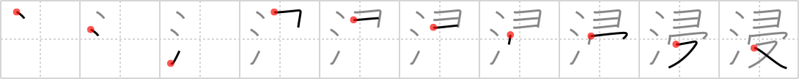

## {1149}

## `immersed`

## [10]

## Reading:

### On-Yomi: シン &mdash; Kun-Yomi: ひた.す、ひた.る

### Examples: 浸す (ひた.す), 浸る (ひた.る)

## Words:

浸ける(つける): dip in, soak

浸す(ひたす): to soak, to dip, to drench
