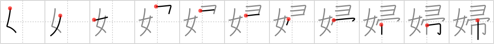

# {婦}

## `lady`

## Strokes: 11

## Reading:

### On-Yomi: フ &mdash; Kun-Yomi: よめ

## Words:

産婦人科(さんふじんか): maternity and gynecology department

主婦(しゅふ): housewife, mistress

夫婦(ふうふ): married couple, spouses, husband and wife, couple, pair

婦人(ふじん): woman, female

看護婦(かんごふ): nurse
