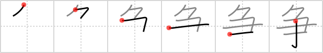

## `contend`

## [6]

## Reading:

### On-Yomi: ソウ &mdash; Kun-Yomi: あらそ.う、いか.でか

## Heisig V6:

Bound up . . . rake.

## Premitive V4:

rake A single vertical stroke transforms broom into a rake. When an element comes above the rake, the vertical stroke is shortened, as we have seen before with other similar primitives such as sheep and cow. Moreover, when something comes above the rake and joins to it at the top, the vertical stroke begins at at the top horizontal stroke, as in the following two FRAMEs. [4]

## Koohii stories:

1) [<a href="http://kanji.koohii.com/profile/DrJones">DrJones</a>] 18-1-2008(174): This can be seen as a Retarius, a roman gladiator. The Retiarius always fought with a net to <em>bound up</em> his opponents, and with a <em>trident</em>, which was able to pierce enemies after tying them. They were terrific <strong>contenders</strong>, so they were only paired with gladiators specially equipped to fight them.

2) [<a href="http://kanji.koohii.com/profile/radical_tyro">radical_tyro</a>] 21-6-2007(93): A boxing ring is <em>bound up</em> by the ropes. The<strong> contend</strong>er is cheating and using a <em>rake</em>.

3) [<a href="http://kanji.koohii.com/profile/SammyB">SammyB</a>] 24-12-2008(82): In an episode of the Simpsons, Sideshow Bob is trying to kill Bart, but on the way has to<strong> contend</strong> with a pile of <em>rakes</em> which keep him <em>bound up</em> for some time.

4) [<a href="http://kanji.koohii.com/profile/decamer0n">decamer0n</a>] 4-5-2007(47): The peasants revolt: if you do weird things to them in your castle, you may have to<strong> contend</strong> with a mob ready to <em>bind you up</em> and beat you to death with <em>rakes</em>.

5) [<a href="http://kanji.koohii.com/profile/synewave">synewave</a>] 13-11-2006(23): One of the<strong> contend</strong>ers in Street Fighter 2 is<em>Vega</em> who has <em>rakes bound</em> to his hands.

6) [<a href="http://kanji.koohii.com/profile/Virtua_Leaf">Virtua_Leaf</a>] 2-10-2009(12): Not only has this<strong> contend</strong>er <em>bound</em> his hands up in barbed wire, he&#039;s also using a <em>rake</em> to fight with! He has to be<strong> contend</strong>er for biggest cheat in history!

7) [<a href="http://kanji.koohii.com/profile/Dragg">Dragg</a>] 24-11-2007(10): No one should have to<strong> contend</strong> with being BOUND UP and RAKED over hot coals.

8) [<a href="http://kanji.koohii.com/profile/Asriel">Asriel</a>] 1-4-2009(7): Japanese Game Show: The<strong> contend</strong>ers have to <em>rake</em> up leaves, otherwise they get <em>bound up</em> with rope and thrown into a volcano.

9) [<a href="http://kanji.koohii.com/profile/Garland">Garland</a>] 12-9-2012(6): This kanji depicts two men <strong>contend</strong>ing in a run competition: One of them is running normally, but the other one has a <em>rake</em> <em>bound</em> to his shoe, so everytime he tries makes a step, he hits himself to the head. No wonder he could never have won the race!

10) [<a href="http://kanji.koohii.com/profile/Matthew">Matthew</a>] 1-3-2009(4): An ancient Roman gladiator <strong>contending</strong> for victory. Specifically he is the type of gladiator known as a “retiarius,” who <em>binds up</em> his opponents with a net then goes in for the kill with his <em>rake</em>-like trident.
