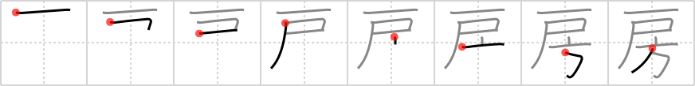

## `tassel`

## [8]

## Reading:

### On-Yomi: ボウ &mdash; Kun-Yomi: ふさ

## Heisig story:

Door . . . compass.

## Koohii stories:

1) [<a href="http://kanji.koohii.com/profile/Transtic">Transtic</a>] 30-1-2008(583): Explanation here: <a href="http://forum.koohii.com/viewtopic.php?pid=14684#p14684">http://forum.koohii.com/viewtopic.php?pid=14684#p14684</a>.

2) [<a href="http://kanji.koohii.com/profile/theasianpleaser">theasianpleaser</a>] 14-11-2008(75): A<strong> tassel</strong> hangs from my <em>door</em> showing the breeze&#039;s <em>direction</em>.

3) [<a href="http://kanji.koohii.com/profile/takoman">takoman</a>] 16-3-2008(54): When you graduate from a school, after they gave you your<strong> tassel</strong>, they shove you to the <em>door</em> and give you a <em>compass</em> saying &quot;Sayonara &amp; Good Luck out there!&quot; (ボウ).

4) [<a href="http://kanji.koohii.com/profile/inaka_rob">inaka_rob</a>] 17-4-2012(31): When you walk in the DOOR to the sumo stadium you will see the 4<strong> TASSEL</strong>S pointing in 4 DIRECTIONS These<strong> TASSEL</strong>S are always placed in the same order: 白房 (しろぶさ) : southwest corner 黒房 (くろぶさ) : northwest corner 赤房 (あかぶさ) : southeast corner 青房 (あおぶさ) : northeast corner (Thanks transtic).

5) [<a href="http://kanji.koohii.com/profile/sweetneet">sweetneet</a>] 24-10-2007(8): At graduation, you are about to enter a new <em>door</em> to your future. to signify that, the speaker guy askes the graduates to move the<strong> tassel</strong> on their hands to the other <em>direction</em>.

6) [<a href="http://kanji.koohii.com/profile/cbogart">cbogart</a>] 23-11-2006(8): A stripper is wearing magic<strong> tassel</strong>s that are like compasses that always point towards whatever she is thinking about. When she is made to dance for customers, the<strong> tassel</strong>s always point towards the door.

7) [<a href="http://kanji.koohii.com/profile/aaronvanvalen">aaronvanvalen</a>] 19-4-2009(5): As you enter a sumo dojo you see the four<strong> tassel</strong>s all pointing into their respective direction.

8) [<a href="http://kanji.koohii.com/profile/gavmck">gavmck</a>] 29-11-2009(4): Continuing from <a href="../v4/1077">shoulder</a> (#1077 肩) the sumo passes through the <em>door</em> and heads in the <em>direction</em> of the 4<strong> tassel</strong>s (thanks Transtic for sumo ring image).

9) [<a href="http://kanji.koohii.com/profile/dihutenosa">dihutenosa</a>] 9-9-2007(4): Actually, the<strong> tassel</strong> I got at graduation is pretty cool. It serves as a sort of <em>compass</em>, pointing me toward the best <em>door</em> of opportunity. I wear my<strong> tassel</strong> wherever I go - when I&#039;m confused: &quot;should I go through this door, or that one? should I go with this girl, or that?&quot;, it spins around and points in the proper direction. Who needs a moral <em>compass</em> - I&#039;ve got my little yellow<strong> tassel</strong>!

10) [<a href="http://kanji.koohii.com/profile/Artur83">Artur83</a>] 10-4-2009(3): Wenn ein Fußballer nach Hause kommt, ohne die Kickschuhe vorher auszuziehen, zeigen die Gras<strong>büschel</strong>, die er in der Wohnung verteilt, an, durch welche <em>Tür</em> er kam und in welche <em>Richtung</em> er danach ging.
