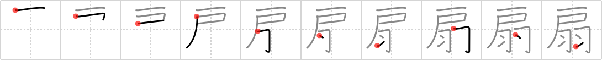

## `fan`

## [10]

## Reading:

### On-Yomi: セン &mdash; Kun-Yomi: おうぎ

## Heisig story:

Door . . . wings.

## Koohii stories:

1) [<a href="http://kanji.koohii.com/profile/Stormchild">Stormchild</a>] 19-7-2006(227): It&#039;s insanely hot today! I&#039;m standing in the <em>doorway</em>,<strong> fan</strong>ning myself with <em>feathers</em>.

2) [<a href="http://kanji.koohii.com/profile/Neobeo">Neobeo</a>] 13-12-2008(71): Home Alone, when the bad guy opens the <em>door</em>, it triggers the<strong> fan</strong> to blow <em>feather</em>s into his face.

3) [<a href="http://kanji.koohii.com/profile/PepeSeco">PepeSeco</a>] 18-10-2010(54): I am a<strong> fan</strong> of The <em>Doors</em> but I also like the <em>Wings</em>. I have a<strong> fan</strong> that I take to rock concerts with the picture of the bands on each side.

4) [<a href="http://kanji.koohii.com/profile/jameserb">jameserb</a>] 25-3-2008(41): The Geisha met her customer beneath the doorway with a<strong> fan</strong> of feathers.

5) [<a href="http://kanji.koohii.com/profile/cameron_en">cameron_en</a>] 12-10-2008(31): Bird flies through <em>door</em>, hits the<strong> fan</strong>, <em>feathers</em>.

6) [<a href="http://kanji.koohii.com/profile/eightyd">eightyd</a>] 4-2-2010(20): I&#039;m a huge anime<strong> fan</strong>. I even went to a anime convention but i could&#039;nt get through the door because my wings wouldn&#039;t fit. Thats the last time I cosplay as Charizard!!!

7) [<a href="http://kanji.koohii.com/profile/Viking101">Viking101</a>] 4-1-2010(13): Normally, the slaves use a giant <em>feathers</em> to<strong> fan</strong> the pharaoh. But, today, one super strong slave used a heavy <em>door</em> to<strong> fan</strong> the pharaoh. Imagine the strength of that<strong> fan</strong>. It&#039;s enough to knock someone over.

8) [<a href="http://kanji.koohii.com/profile/kansaigaijin">kansaigaijin</a>] 30-7-2009(7): Before AC, the best way to get cool was to stand in the <em>door</em>way with a <em>feather</em> <strong>fan</strong> and<strong> fan</strong> yourself. Just think of a hot street with all the old women looking out form their doorways<strong> fan</strong>ning themselves with traditional feather<strong> fan</strong>s.

9) [<a href="http://kanji.koohii.com/profile/Filip">Filip</a>] 24-1-2008(7): The biology lab has a<strong> fan</strong> installed above the door. a guy walks in &#039;look professor, the box with the rare species of feathers has arrived.&#039; and he opens it....

10) [<a href="http://kanji.koohii.com/profile/ziggr">ziggr</a>] 24-5-2007(7): One Haibane&#039;s job is to stand in the <em>door</em>way and <strong>fan</strong> customers with her little charcoal <em>feathers</em>.
