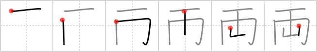

## `both`

## [6]

## Reading:

### On-Yomi: リョウ &mdash; Kun-Yomi: てる、ふたつ

## Words:

両極(りょうきょく): both extremities, north and south poles, positive and negative poles

両立(りょうりつ): compatibility, coexistence, standing together

両替(りょうがえ): change, money exchange

両側(りょうがわ): both sides

両方(りょうほう): both

両親(りょうしん): parents, both parents

## Koohii stories:

1) [<a href="http://kanji.koohii.com/profile/synewave">synewave</a>] 26-8-2006(276): Primatives <em>celing; belt; mountain</em> as per Cumulative Errata. See volfy post for link.<strong> Both</strong> effective ways to commit suicide, hang your self from the <em>celing</em> with your <em>belt</em> or jump off a <em>mountain</em>. 

2) [<a href="http://kanji.koohii.com/profile/PepeSeco">PepeSeco</a>] 19-2-2008(37): Under one <em>ceiling</em><strong> both</strong> took off their <em>belts</em> in Brokeback <em>Mountain</em>. 

3) [<a href="http://kanji.koohii.com/profile/smithsonian">smithsonian</a>] 14-5-2007(36): Be careful with this one. The correct primitive order is <em>ceiling</em> . . . <em>belt</em> . . . <em>mountain</em>. That said, in the Mario video games, there are some levels where spikes hang from the <em>ceiling</em> and there are large conveyor <em>belts</em>. One example is Koopa <em>Mountain</em>. Imagine<strong> both</strong> Mario and Luigi trying to get through the level unscathed. 

4) [<a href="http://kanji.koohii.com/profile/volfy">volfy</a>] 2-4-2006(26): Matticus, the errata at www.nanzan-u.ac.jp/ SHUBUNKEN/publications/miscPublications/ Remembering_the_Kanji_1.htm reflects your view of how the character should be written. Everyone should take a look and correct all the listed errors in the book. 

5) [<a href="http://kanji.koohii.com/profile/bihzad">bihzad</a>] 12-3-2008(16): <strong>Both</strong> the ceiling of heaven and the mountains are belted to the Earth. 

6) [<a href="http://kanji.koohii.com/profile/Spidercat">Spidercat</a>] 7-2-2008(15): Primatives celing; belt; mountain as per Cumulative Errata. On this pic Fujiyama <em>mountain</em> seems to have<strong> both</strong> a cloud <em>ceiling</em> and a <em>belt</em> : <a href="http://www.histarmar.com.ar/ArchivoFotosGral/AAFotosSorprendentes/Fujiyama.jpg">http://www.histarmar.com.ar/ArchivoFotosGral/AAFotosSorprendentes/Fujiyama.jpg</a>. 

7) [<a href="http://kanji.koohii.com/profile/matticus">matticus</a>] 14-12-2006(15): Is it just me, or is Heisig completely wrong about stroke order a lot of the time? This character is written like <em>ceiling</em>...<em>belt</em>...<em>mountain</em>. I imagine two mountains in the background of a school play,<strong> both</strong> <em>belted</em> to the ceiling. 

8) [<a href="http://kanji.koohii.com/profile/Meconium">Meconium</a>] 27-7-2009(10): <em>One, belt, mountain</em>. Simplified form of 兩. Although they were <strong>both</strong> guys, after taking off their <em>belts</em> they were still able to become <em>one</em> physically and emotionally, under the shadow of Brokeback <em>Mountain</em>. 

9) [<a href="http://kanji.koohii.com/profile/mspertus">mspertus</a>] 19-1-2007(7): A vampire slayer&#039;s utility <em>belt</em> obviously needs<strong> both</strong> a <em>stake</em> and a <em>shovel</em>. 

10) [<a href="http://kanji.koohii.com/profile/Hinsoog">Hinsoog</a>] 18-2-2012(5): This guy couldn&#039;t decide whether to hang himself with his <em>belt</em> or to throw himself off of a <em>mountain</em>, because he figured that in suicide you can only choose <em>one</em>. In the end he didn&#039;t choose <em>one</em>, he chose<strong> both</strong>. He gagged himself with his <em>belt</em> and then lept off the top of a <em>mountain</em>. 
