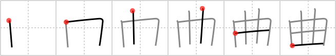

## `bend`

## [6]

## Reading:

### On-Yomi: キョク &mdash; Kun-Yomi: ま.がる、ま.げる

## Heisig story:

Picture yourself grabbing hold of the two strokes poking out the top of the kanji and wrenching them apart, thus giving the sense of <b>bend</b>. If you think of them as deriving from the element for <i>brains</i> beneath (of course, the middle stroke has been reduplicated and pulled out to where it can be grabbed hold of), you can associate the key word with <b>bending</b> someone's mind to your own point of view.

## Koohii stories:

1) [<a href="http://kanji.koohii.com/profile/fuaburisu">fuaburisu</a>] 28-10-2005(250): It looks like the mouth of <em>Bender the robot</em>, from Matt Groening&#039;s animated series &quot;Futurama&quot;. Thus, I use the character <em>Bender the robot</em> as a primitive.

2) [<a href="http://kanji.koohii.com/profile/Raichu">Raichu</a>] 5-9-2006(120): Also means &quot;melody&quot;. Think of it as a pictogram of a guitar where you have to <strong>bend</strong> the strings to make a <strong>melody</strong>.

3) [<a href="http://kanji.koohii.com/profile/Peppi">Peppi</a>] 24-4-2009(87): When <em>two sprouts sprout</em> at the same place they don&#039;t have enough space and have to<strong> bend</strong> in different directions to grow...

4) [<a href="http://kanji.koohii.com/profile/smithsonian">smithsonian</a>] 27-2-2007(15): Hannibal Lecter exposes his victim&#039;s <em>brains</em> and inserts two <em>walking sticks</em>, using them to<strong> bend</strong> the victim to his will. Note: Heisig implies this, but doesn&#039;t show the actual stroke order. Write this in the same order as <a href="../14">rice field</a> (#14 田) but with two extended vertical strokes in the center instead of one short stroke.

5) [<a href="http://kanji.koohii.com/profile/taikura">taikura</a>] 24-12-2008(13): This is a guitar fretboard. You have to<strong> bend</strong> the strings to produce a <em>melody</em>.

6) [<a href="http://kanji.koohii.com/profile/guidedog">guidedog</a>] 25-7-2007(6): The mind-bending power of two brains.

7) [<a href="http://kanji.koohii.com/profile/Codexus">Codexus</a>] 28-12-2007(4): Uri Geller can<strong> bend</strong> two metal bars with the power of his <em>brain</em>.

8) [<a href="http://kanji.koohii.com/profile/Median">Median</a>] 13-8-2012(2): I played a <strong>piece of music</strong> by<strong> bend</strong>ing the strings of the guitar. KYOKU | MAgaru.

9) [<a href="http://kanji.koohii.com/profile/jbudding">jbudding</a>] 18-6-2011(2): When you<strong> BEND</strong> someone&#039;s mind it&#039;s like pulling apart his <em>brain</em> with two <em>sticks</em> driven into it for handles.

10) [<a href="http://kanji.koohii.com/profile/brainrobert1">brainrobert1</a>] 27-7-2010(2): Guitar + melody +<strong> bend</strong>. From this strange guitar the musician could<strong> bend</strong> the strings and produce sweet melodies.<strong> bend</strong> is magaru <a href="midori://search?text=曲が、">曲が、</a> melody is kyoku 曲 .
