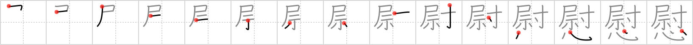

## `consolation`

## [15]

## Reading:

### On-Yomi: イ &mdash; Kun-Yomi: なぐさ.める、なぐさ.む

## Heisig story:

Military officer . . . heart.

## Koohii stories:

1) [<a href="http://kanji.koohii.com/profile/decamer0n">decamer0n</a>] 27-5-2007(287): A <em>military officer</em> must offer<strong> consolation</strong> to the <em>hearts</em> of the families of his fallen men.

2) [<a href="http://kanji.koohii.com/profile/RobMow">RobMow</a>] 8-9-2008(107): This Kanji appears in the word 慰安婦 いあんふ, which was what the infamous WW II &quot;comfort women&quot; were called in Japanese. The story goes something like this: As a way of providing<strong> consolation</strong> to battle-weary, <em>heartsick military officers and soldiers</em>, the Japanese set up comfort stations (brothels) for their servicemen. (Just to be clear: this is not an endorsement of the practice, just a way to remember the Kanji.).

3) [<a href="http://kanji.koohii.com/profile/shakkun">shakkun</a>] 14-6-2008(39): The MILITARY OFFICER is given a Purple HEART by the army as<strong> consolation</strong> for the wounds he received in the line of duty.

4) [<a href="http://kanji.koohii.com/profile/hunchbag">hunchbag</a>] 19-11-2009(33): The <em>military officer</em> consoles the parents: &quot;Well, your son did not win the war. He died. But, as a<strong> consolation</strong> prize, you get his <em>heart</em>!&quot; TA-DAAA!! &quot;Thanks for playing, folks!&quot; (cue screaming).

5) [<a href="http://kanji.koohii.com/profile/Virtua_Leaf">Virtua_Leaf</a>] 17-12-2007(12): &quot;My time in the army was complete misery.&quot; - &quot;Well if it&#039;s any<strong> consolation</strong> that bastard <em>military officer</em> had a <em>heart</em> attack.&quot;.

6) [<a href="http://kanji.koohii.com/profile/Wosret">Wosret</a>] 2-9-2008(5): A <strong>military officer</strong> will receive a a purple <strong>heart</strong> as a<strong> consolation</strong> for risking their lives bravely enough.

7) [<a href="http://kanji.koohii.com/profile/tritonxg">tritonxg</a>] 24-3-2010(4): [FR]réconfort N1 <strong>I nagusa(meru/mu) </strong> k&amp;k1618 <em>officier+coeur </em><strong>femmes de réconfort :</strong> elles étaient livrées à des OFFICIERS sans COEUR 慰んだ挙句に捨てる 【なぐさんだあげくにすてる】to throw a girl away after making her one&#039;s plaything 慰安婦 【いあんふ】army prostitute 慰霊祭 【いれいさい】memorial service 慰労金 【いろうきん】bonus;reward for one&#039;s services 自慰 【じい】self<strong> consolation</strong>;masturbation.

8) [<a href="http://kanji.koohii.com/profile/ambassadog">ambassadog</a>] 14-10-2009(4): The <em>military officer</em> is dissapointed (<em>heart</em>broken, actually) that he has to sit out a battle due to an injury. As a<strong> consolation</strong>, a soldier brings him the still-warm <em>heart</em> of an enemy to make him feel better.

9) [<a href="http://kanji.koohii.com/profile/snispilbor">snispilbor</a>] 5-6-2008(4): A <em>military officer</em> offers<strong> consolation</strong> to the <em>hearts</em> of the families of the fallen. (h/t decamer0n) You also need to distinguish this from &quot;condolences&quot;, though. For that, imagine the military officer shows up, and starts rudely playing the dead soldier&#039;s old <em>console</em> (wii, xbox, whatever).

10) [<a href="http://kanji.koohii.com/profile/usis35">usis35</a>] 5-5-2013(3): The mother knew it deep in her heart. Finally, the day came: The <a href="../v4/1095">military officer</a> (#1095 尉) knocked at the door. He was handling the HEART of the fallen kid to the family (a <em>military officer</em> must offer<strong> consolation</strong> to the family of his fallen men).

### {V4: 1096, V6: 1177}
