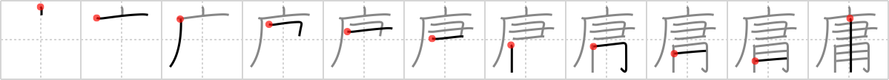

## `comfortable`

## [11]

## Reading:

### On-Yomi: ヨウ

## Heisig V6:

Cave . . . rake . . . screwdriver.

## Koohii stories:

1) [<a href="http://kanji.koohii.com/profile/rtkrtk">rtkrtk</a>] 15-1-2008(246): To live a<strong> comfortable</strong> life, single men need only a cave for living, a rake for cleaning and a screwdriver for fixing.

2) [<a href="http://kanji.koohii.com/profile/Stormchild">Stormchild</a>] 3-8-2006(68): When I first moved in to my new <em>cave</em>, all I had was a bed (see <a href="../592">bed</a> (#592 床)). But now I&#039;ve settled in, got myself a few handy things like a <em>rake</em> and a <em>screwdriver</em>, and made myself more<strong> comfortable</strong>.

3) [<a href="http://kanji.koohii.com/profile/jameserb">jameserb</a>] 27-4-2008(49): To make your cave more<strong> comfortable</strong>, you&#039;ll need to do some work with a rake and screwdriver. Clean it up. Fix a few things.

4) [<a href="http://kanji.koohii.com/profile/herman">herman</a>] 24-11-2008(21): Commonplace seems like a better keyword for this, though it&#039;s easier to confuse with others like &quot;usual&quot; and &quot;mediocre&quot;. In this case, commonplace refers to something ordinary and non-exceptional. I picture a commonplace caveman&#039;s cave, with very ordinary, non-fancy, cave drawings he did with a screwdriver because he couldn&#039;t afford a writing brush. You have to visualize him etching the drawings with the screwdriver.

5) [<a href="http://kanji.koohii.com/profile/Spidercat">Spidercat</a>] 8-2-2008(18): (Thanks rtkrtk) To live a<strong> comfortable</strong> life, the Flintstones need only a cave for living, a rake for cleaning and a screwdriver for fixing.

6) [<a href="http://kanji.koohii.com/profile/LazyNomad">LazyNomad</a>] 4-5-2009(14): (tweak to rtkrtk story) To live a<strong> comfortable</strong> life, single men need only a <em>cave</em> for living and a special <em>rake-screwdriver</em> for cleaning-fixing. (Imagine this strange tool which has a <em>rake</em> attached to one end, and a <em>screwdriver</em> to the other. Though not so<strong> comfortable</strong> to use, but it seems that our caveman prefers it this way).

7) [<a href="http://kanji.koohii.com/profile/brian44">brian44</a>] 28-11-2007(9): For COMMONPLACE, we have a Cave a Rake and a Screwdriver. Well, in the &quot;Caves&quot; of your garage, things like Rakes and Screwdrivers are just COMMONPLACE.

8) [<a href="http://kanji.koohii.com/profile/Codexus">Codexus</a>] 28-12-2007(7): After all the hard work to <em>rake</em> some Tang from the <em>cave</em> walls (see <a href="../1157">T'ang</a> (#1157 唐)). It&#039;s good to relax <strong>comfortably</strong> and add some Vodka to enjoy a <em>Screwdriver</em> cocktail. (<strong>STROKE ORDER</strong>: one vertical stroke through both rake and screwdriver last).

9) [<a href="http://kanji.koohii.com/profile/Raschaverak">Raschaverak</a>] 10-8-2009(6): To turn your commonplace cave into a<strong> comfortable</strong> mansion..you just need a rake (for working outside) and a screwdriver (for working inside). Yay!

10) [<a href="http://kanji.koohii.com/profile/j0k0m0">j0k0m0</a>] 26-1-2010(5): Robin commonly gets<strong> comfortable</strong> by raking the rocks and sipping screwdrivers in the bat cave....1 凡庸 ぼんよう (adj-na,n,adj-no) mediocre; banality; commonplace...6 庸愚 ようぐ (adj-na,n) mediocrity; imbecility ...9 庸人 ようじん (n) common man.
