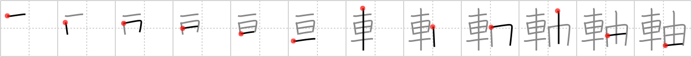

## `axis`

## [12]

## Reading:

### On-Yomi: ジク

## Heisig story:

Car . . . shoot.

## Koohii stories:

1) [<a href="http://kanji.koohii.com/profile/kyldyyr">kyldyyr</a>] 25-11-2005(176): An absurd image, but what the heck - worked for me. Imagine a <em>car</em> going across a plain at a fast speed. Suddenly a single <em>sprout</em> (the only one to be seen) gets stuck to the car&#039;s wheels, causing the car to fly around its<strong> axis</strong>.

2) [<a href="http://kanji.koohii.com/profile/smithsonian">smithsonian</a>] 4-3-2007(130): The Germans manufactured so many <em>cars</em> during World War II that it was almost as if they were <em>sprouting</em> from the factories of the<strong> Axis</strong>.

3) [<a href="http://kanji.koohii.com/profile/samuize">samuize</a>] 13-12-2007(51): Left side is the car, right side is a zoomed in picture of the car showing the detail of the axle/axis.

4) [<a href="http://kanji.koohii.com/profile/dukelexon">dukelexon</a>] 30-12-2007(27): George W. Bush placed a great deal of Middle Eastern countries in his &quot;<strong>Axis</strong> of Evil&quot; ... perhaps because that region is the <em>sprouting origin</em> of what we have to put into our <em>cars</em> (let&#039;s bring back the electric car, eh?).

5) [<a href="http://kanji.koohii.com/profile/etpan">etpan</a>] 23-11-2008(25): James Bond has guns that <em>sprout</em> from the wheel <strong>axes</strong> of his <em>car</em>.

6) [<a href="http://kanji.koohii.com/profile/kuraujiokun">kuraujiokun</a>] 10-7-2009(24): <em>[Cars]</em> run along the <strong>x-axis</strong> and plants <em>[sprouts]</em> along the <strong>y-axis</strong>.

7) [<a href="http://kanji.koohii.com/profile/dshill99">dshill99</a>] 2-9-2008(12): A <em>car</em> <em>sprouts</em> from its<strong> axis</strong>.

8) [<a href="http://kanji.koohii.com/profile/dvknoke">dvknoke</a>] 30-11-2011(9): (Note: This kanji is also used for the word &quot;axle&quot;.) The axles for the car wheels--those four little rods which <em>sprout</em> from the sides of the <em>car</em> and form the<strong> axis</strong> around which the wheels rotate.

9) [<a href="http://kanji.koohii.com/profile/Alunalun">Alunalun</a>] 20-7-2009(6): You haven&#039;t used your car for a while so on the wheels of your <em>car</em> you have lots of plants trying to <em>sprout</em>. When you start using it again most of the <em>shoots</em> on the wheels die, killed by the constant shaking. However, the shoots on the<strong> axis</strong> of rotation survive and flourish, because this is the only part of the wheel where there&#039;s no movement.

10) [<a href="http://kanji.koohii.com/profile/Tzadeck">Tzadeck</a>] 21-5-2009(5): If you take a graph and put the number of <em>cars</em> in the United States on the x-<strong>axis</strong>, and on the right you put the number of <em>brussel sprouts</em> eaten by the average family on the y-<strong>axis</strong>, you&#039;ll find that they&#039;re inversely proportional.
