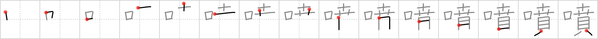

# {1197}

## `erupt`

## [15]

## Reading:

### On-Yomi: フン &mdash; Kun-Yomi: ふ.く

### Examples: 噴く (ふ.く)

## Words:

噴出(ふんしゅつ): spewing, gushing, spouting, eruption, effusion

噴火(ふんか): eruption

噴水(ふんすい): water fountain
