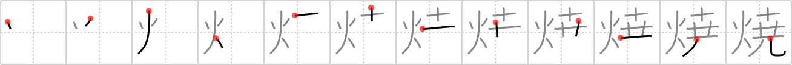

# {焼}

## `bake`

## Strokes: 12

## Reading:

### On-Yomi: ショウ &mdash; Kun-Yomi: や.く、や.き、や.き-、-や.き、や.ける

### Examples: 焼く (や.く), 焼ける (や.ける)

## Words:

燃焼(ねんしょう): burning, combustion

日焼け(ひやけ): sunburn

夕焼け(ゆうやけ): sunset

焼く(やく): bake, grill

焼ける(やける): be burned
