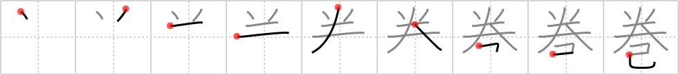

# {巻}

## `scroll`

## Strokes: 9

## Reading:

### On-Yomi: カン、ケン &mdash; Kun-Yomi: ま.く、まき、ま.き

### Examples: 巻き (ま.き), 巻く (ま.く)

## Words:

取り巻く(とりまく): to surround, to circle, to enclose

巻(まき): volume

寝巻(ねまき): sleep-wear, nightclothes, pyjamas, nightgown, nightdress

巻く(まく): wind, coil, roll
