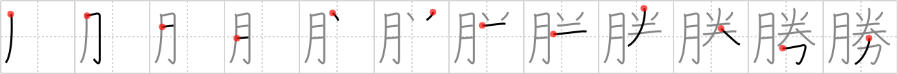

## {1209}

## `victory`

## [12]

## Reading:

### On-Yomi: ショウ &mdash; Kun-Yomi: か.つ、-が.ち、まさ.る、すぐ.れる、かつ

### Examples: 勝つ (か.つ), 勝る (まさ.る)

## Words:

決勝(けっしょう): decision of a contest, finals (in sports)

勝負(しょうぶ): victory or defeat, match, contest, game, bout

勝利(しょうり): victory, triumph, conquest, success, win

勝る(まさる): to excel, to surpass, to outrival

勝ち(かち): win, victory

勝敗(しょうはい): victory or defeat, issue (of battle)

優勝(ゆうしょう): overall victory, championship

勝つ(かつ): to win
