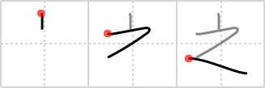

## `of`

## [3]

## Reading:

### On-Yomi: シ &mdash; Kun-Yomi: の、これ、おいて、ゆく、この

## Heisig story:

This character is now used chiefly in proper names, and is best learned as the character closest to the hiragana え, though in fact it has no relation to it.

## Koohii stories:

1) [<a href="http://kanji.koohii.com/profile/Katsuo">Katsuo</a>] 4-11-2007(292): <strong>Of</strong> all the kanji, this is the only one 之 orro can write.

2) [<a href="http://kanji.koohii.com/profile/Filip">Filip</a>] 31-1-2008(110): The Z<strong> of</strong> Zorro (and yes he has a hat).

3) [<a href="http://kanji.koohii.com/profile/aircawn">aircawn</a>] 7-2-2007(49): &quot;Hey Zorro, would you sign my chest?&quot; &quot;Why<strong> of</strong> course!&quot; Long story short: he didn&#039;t use a pen...

4) [<a href="http://kanji.koohii.com/profile/Groot">Groot</a>] 13-4-2010(16): The mark <strong>of</strong> 之 orro!

5) [<a href="http://kanji.koohii.com/profile/DrJones">DrJones</a>] 31-1-2008(10): My kanji dictionaries state that this is an alternate kanji for これ (<strong>this one</strong>) ( 此れ being the other form). It looks like a very small <em>person</em> 人 who lifts a <em>hat</em> with his <em>arm</em>. I like to think<strong> of</strong> him as a <em>gardener</em> with a Panama Hat, but it could also be the almighty Zorro!

6) [<a href="http://kanji.koohii.com/profile/Stormchild">Stormchild</a>] 25-2-2007(6): Zorro is known for slashing a &#039;Z&#039; with his sword, but nobody&#039;s impressed by that anymore. He&#039;s decided to get everyone&#039;s attention again by pouring gasoline in a hillside field to create a giant Z<strong> of</strong> fire. (The &#039;Z&#039; is to remind me which character this is, since the keyword is pretty much completely useless. Along with that, I use an adaptation<strong> of</strong> Johnny Cash -- &quot;Burnin&#039; Z<strong> of</strong> fire...&quot;).

7) [<a href="http://kanji.koohii.com/profile/jbudding">jbudding</a>] 27-6-2011(5): The kanji<strong> OF</strong> Zorro with his stylized <em>top hat</em> and a swoosh.

8) [<a href="http://kanji.koohii.com/profile/usis35">usis35</a>] 17-2-2010(5): Marcando la 之 DE 之 orro (3 strokes).

9) [<a href="http://kanji.koohii.com/profile/Errol246">Errol246</a>] 20-10-2012(3): How about a stroke order, Heisig?

10) [<a href="http://kanji.koohii.com/profile/gavin.schultz-ohkubo">gavin.schultz-ohkubo</a>] 31-5-2010(3): <strong>Of</strong> all the movies that abuse the &quot;X<strong> of</strong> Y&quot; title formula, 之 orro is one<strong> of</strong> the worst: &quot;Mark<strong> of</strong> Zorro&quot;, &quot;Son<strong> of</strong> Zorro&quot;, &quot;Sign<strong> of</strong> Zorro&quot;, &quot;Mask<strong> of</strong> Zorro&quot;, &quot;Legend<strong> of</strong> Zorro&quot;, &quot;Ghost<strong> of</strong> Zorro&quot;...
