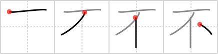

## `negative`

## [4]

## Reading:

### On-Yomi: フ、ブ

### Examples: 不当 (ふとう), 不利 (ふり), 不賛成 (ふさんせい)

## Words:

不意(ふい): sudden, abrupt, unexpected, unforeseen

不可欠(ふかけつ): indispensable, essential

不吉(ふきつ): ominous, sinister, bad luck, ill omen, inauspiciousness

不況(ふきょう): recession, depression, slump

不景気(ふけいき): business recession, hard times, depression, gloom, sullenness, cheerlessness

不在(ふざい): absence

不山戯る(ふざける): to romp, to gambol, to frolic, to joke, to make fun of, to flirt

不順(ふじゅん): irregularity, unseasonableness

不振(ふしん): dullness, depression, slump, stagnation

不審(ふしん): incomplete understanding, doubt, question, distrust, suspicion, strangeness, infidelity

不調(ふちょう): bad condition, not to work out (ie a deal), disagreement, break-off, disorder, slump, out of form

不当(ふとう): injustice, impropriety, unreasonableness, undeservedness, unfair, invalid

不動産(ふどうさん): real estate

不評(ふひょう): bad reputation, disgrace, unpopularity

不便(ふびん): pity, compassion

不服(ふふく): dissatisfaction, discontent, disapproval, objection, complaint, protest, disagreement

不明(ふめい): unknown, obscure, indistinct, uncertain, ambiguous, ignorant, lack of wisdom, anonymous, unidentified

不良(ふりょう): badness, delinquent, inferiority, failure

不味い(まずい): unappetising, unpleasant (taste appearance situation), ugly, unskilful, awkward, bungling, unwise, untimely

不安(ふあん): anxiety, uneasiness, insecurity, suspense

不運(ふうん): unlucky, misfortune, bad luck, fate

不可(ふか): wrong, bad, improper, unjustifiable, inadvisable

不規則(ふきそく): irregularity, unsteadiness, disorderly

不潔(ふけつ): unclean, dirty, filthy, impure

不幸(ふこう): unhappiness, sorrow, misfortune, disaster, accident, death

不思議(ふしぎ): wonder, miracle, strange, mystery, marvel, curiosity

不自由(ふじゆう): discomfort, disability, inconvenience, destitution

不正(ふせい): injustice, unfairness, iniquity, impropriety, irregularity, dishonesty, illegality

不足(ふそく): insufficiency, shortage, deficiency, lack

不通(ふつう): suspension, interruption, stoppage, tie-up, cessation

不平(ふへい): complaint, discontent, dissatisfaction

不満(ふまん): dissatisfaction, displeasure, discontent, complaints, unhappiness

不利(ふり): disadvantage, handicap, unfavorable, drawback

不便(ふべん): inconvenience

## Koohii stories:

1) [<a href="http://kanji.koohii.com/profile/laner36">laner36</a>] 24-9-2007(194): [Smithsonian] Scene: <em>Mr. T</em> hanging from the <em>ceiling</em> being tortured. He is asked if he is going to talk. Spitting (a <em>drop</em> of saliva) in the torturer&#039;s face, he says &quot;Negative&quot;. 

2) [<a href="http://kanji.koohii.com/profile/Thunderball">Thunderball</a>] 20-8-2007(45): <em>One below</em> zero is a<strong> negative</strong> number. 

3) [<a href="http://kanji.koohii.com/profile/ruuku35">ruuku35</a>] 4-6-2006(29): If just ONE PERSON has a DROP of NEGATIVITY it can make everyone<strong> NEGATIVE</strong>. 

4) [<a href="http://kanji.koohii.com/profile/FoxintheStars">FoxintheStars</a>] 22-1-2011(13): A minus sign with an arrow pointing up at it, indicating that this is the symbol that means<strong> negative</strong>. 

5) [<a href="http://kanji.koohii.com/profile/owenjd">owenjd</a>] 9-11-2008(12): Anything smaller than 1 is<strong> negative</strong>. 

6) [<a href="http://kanji.koohii.com/profile/jonjimbo2000">jonjimbo2000</a>] 5-6-2008(9): Pictograph. Looks a bit like a combination of フ and F for fail - very<strong> negative</strong>. 

7) [<a href="http://kanji.koohii.com/profile/kapalama">kapalama</a>] 11-7-2010(4):   <a href="http://jisho.org/kanji/details/不安">不安</a>  ,   <a href="http://jisho.org/kanji/details/不満">不満</a>  ,   <a href="http://jisho.org/kanji/details/不便">不便</a>  　<a href="../1217">negative</a> (#1217 <a href="http://jisho.org/kanji/details/不">不</a>) フ, ブ ... Parts:  <a href="http://jisho.org/kanji/details/一">一</a>  , 亻, 丶 ... Note: IRL it is hard to tell   <a href="http://jisho.org/kanji/details/不">不</a>  <a href="../1217">negative</a> (#1217 <a href="http://jisho.org/kanji/details/不">不</a>),   <a href="http://jisho.org/kanji/details/無">無</a>  <a href="../1775">nothingness</a> (#1775 <a href="http://jisho.org/kanji/details/無">無</a>),   <a href="http://jisho.org/kanji/details/非">非</a>  <a href="../1632">un-</a> (#1632 <a href="http://jisho.org/kanji/details/非">非</a>) apart, meaning-wise. They are all prefixes that negate, like the English prefixes &#039;un&#039; and &#039;in&#039;. Worse yet, both   <a href="http://jisho.org/kanji/details/不">不</a>  , and   <a href="http://jisho.org/kanji/details/無">無</a>   can be pronounced ブ. Fun fact: &#039;Fu&#039; in kana (フand ふ) both came from this Kanji. ...   <a href="http://jisho.org/kanji/details/熟語">熟語</a>  :  <a href="http://jisho.org/kanji/details/不倫">不倫</a>  ,   <a href="http://jisho.org/kanji/details/不足">不足</a>  ,   <a href="http://jisho.org/kanji/details/不景気">不景気</a>   ... cf:   <a href="http://jisho.org/kanji/details/至">至</a>  . 

8) [<a href="http://kanji.koohii.com/profile/crayonmaster">crayonmaster</a>] 1-4-2009(4): (Looks like a ceiling and an arrow pointing up)<strong> Negative</strong> people are always pointing up towards the ceiling to show how far down they still are. 

9) [<a href="http://kanji.koohii.com/profile/smithsonian">smithsonian</a>] 6-3-2007(4): Hanging from the <em>ceiling</em>, <em>Mr. T</em> spits out a <em>drop</em> of saliva in the hopes that the<strong> negative</strong> weight will allow him to climb to safety. 

10) [<a href="http://kanji.koohii.com/profile/Ricardo">Ricardo</a>] 22-10-2006(4): [negative; non-; bad; ugly; clumsy] Think of the horizontal line as the Y axis of a 2d graphic. All other lines are below it, so they have a <strong>negative</strong> y value. 
