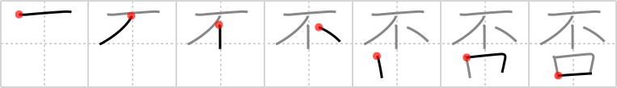

# {否}

## `negate`

## Strokes: 7

## Reading:

### On-Yomi: ヒ &mdash; Kun-Yomi: いな、いや

### Examples: 否 (いな)

## Words:

拒否(きょひ): denial, veto, rejection, refusal

否決(ひけつ): rejection, negation, voting down

否(いや): no, nay, yes, well

否定(ひてい): negation, denial, repudiation
