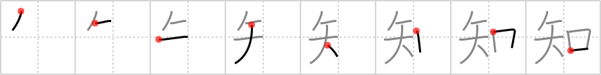

# {知}

## `know`

## Strokes: 8

## Reading:

### On-Yomi: チ &mdash; Kun-Yomi: し.る、し.らせる

### Examples: 知 (しる)

## Words:

旧知(きゅうち): old friend, old friendship

知り合い(しりあい): acquaintance

知人(ちじん): friend, acquaintance

知性(ちせい): intelligence

知的(ちてき): intellectual

未知(みち): not yet known

無知(むち): ignorance

知らせ(しらせ): notice

知恵(ちえ): wisdom, wit, sagacity, sense, intelligence, advice

知事(ちじ): prefectural governor

知識(ちしき): knowledge, information

知能(ちのう): intelligence, brains

通知(つうち): notice, notification

承知(しょうち): consent, agree

知らせる(しらせる): let know, inform, tell

知る(しる): know, understand, be acquainted with, feel
