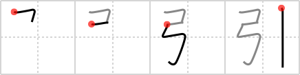

## `pull`

## [4]

## Reading:

### On-Yomi: イン &mdash; Kun-Yomi: ひ.く、ひ.き、ひ.き-、-び.き、ひ.ける

## Heisig V6:

Bow . . . walking stick.

## Koohii stories:

1) [<a href="http://kanji.koohii.com/profile/radical_tyro">radical_tyro</a>] 24-6-2007(188): Put a <em>walking stick</em> in the <em>bow</em> and<strong> pull</strong> it back, ready to fire at the geezer.

2) [<a href="http://kanji.koohii.com/profile/eugs51">eugs51</a>] 2-11-2007(175): This is actually a bow and an arrow. (Real origin of this kanji).<strong> Pull</strong> and release to fire!

3) [<a href="http://kanji.koohii.com/profile/scottamus">scottamus</a>] 13-11-2005(20): Legolas catches Frodo<strong> pull</strong>ing on his <em>walking stick</em>. I&#039;ll let you decide what that means exactly.

4) [<a href="http://kanji.koohii.com/profile/akrodha">akrodha</a>] 5-4-2007(19): If you<strong> pull</strong> at the ends of a <em>bow</em> long enough, you&#039;ll deform it to make a decent <em>walking stick</em>. This was a tactic used by injured archers to escape battle.

5) [<a href="http://kanji.koohii.com/profile/dilandau23">dilandau23</a>] 11-2-2007(10): This is the story of Odysseus’ great <em>bow</em>, here we see it as the <em>bow</em> both strung(as <em>bow</em>) and unstrung(as <em>walking stick</em>). The challenge was given by Odysseus&#039; wife (Penelope) to see who had strength enough to<strong> pull</strong> the bow and string it.

6) [<a href="http://kanji.koohii.com/profile/j0k0m0">j0k0m0</a>] 24-7-2009(7): Bow and string .<strong> Pull</strong>.

7) [<a href="http://kanji.koohii.com/profile/mantixen">mantixen</a>] 7-7-2009(5): You can make a <em>walking stick</em> into a <em>bow</em> by<strong> pull</strong>ing it back.

8) [<a href="http://kanji.koohii.com/profile/TStroke">TStroke</a>] 24-12-2011(4): Legolas has run out of arrows and<strong> pull</strong>s the walking stick from under an old man and fires it into the eye of an enemy. On the background you see the old man faling down some stairs.

9) [<a href="http://kanji.koohii.com/profile/nussram">nussram</a>] 2-7-2012(3): Legolas to Saruman: “Here’s your walking stick, old man.” He then<strong> pull</strong>s back on his bow and shoots Saruman with his own walking stick.

10) [<a href="http://kanji.koohii.com/profile/peacemik">peacemik</a>] 18-7-2008(3): Embellishing radical_tyro&#039;s story: The old kyudo ( 弓道 (きゅどう): Japanese archery) master&#039;s favorite possessions are his <em>bow</em> and his <em>walking stick</em>. Sometimes, to show off, he puts his <em>walking stick</em> in the <em>bow</em>,<strong> pull</strong>s it back, and fires, always hitting the target. (No mean feat, considering that in kyudo, you have to hit a 36-cm-diameter target from a distance of 28 m). 引く (ひく): to<strong> pull</strong>, attract, drain 引力 (いんりょく): attractive force, gravity.
