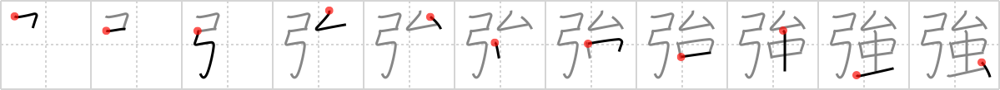

## `strong`

## [11]

## Reading:

### On-Yomi: キョウ、ゴウ &mdash; Kun-Yomi: つよ.い、つよ.まる、つよ.める、し.いる、こわ.い

## Heisig story:

<i>Vast</i> . . . <i>insect</i>. Note how the <i>elbow</i> of <i>vast</i> is shrunken and elevated to make room for the <i>insect</i> beneath.

## Koohii stories:

1) [<a href="http://kanji.koohii.com/profile/jaresty">jaresty</a>] 10-11-2007(176): An insect who can fly vast distances is<strong> strong</strong>.

2) [<a href="http://kanji.koohii.com/profile/sweetneet">sweetneet</a>] 19-7-2006(106): The <em>vast</em> majority of <em>insect</em>s are pretty<strong> strong</strong>; ants can carry 10x their weight!

3) [<a href="http://kanji.koohii.com/profile/akrodha">akrodha</a>] 16-5-2008(49): There was once a legendary archer, who was known for being incredibly<strong> strong</strong>. In reality he was very weak but had a powerful <em>insect friend</em> who tugged on his <em>elbow</em> while pulling on his <em>bow</em> and arrow.

4) [<a href="http://kanji.koohii.com/profile/dingomick">dingomick</a>] 14-2-2007(49): Legolas is so <strong>strong</strong> that he can even shoot down <em>vast</em> numbers of tiny <em>insects</em> at <em>vast</em> distances with ease.

5) [<a href="http://kanji.koohii.com/profile/tristanthorn">tristanthorn</a>] 18-3-2009(21): When using a <em>bow</em>, you need a<strong> strong</strong> arm, and a steady <em>elbow</em> to hit an <em>insect</em>.

6) [<a href="http://kanji.koohii.com/profile/gorgon">gorgon</a>] 1-3-2006(15): Legolas (or whoever) whose bendy elbow allows him to shoot <em>vast</em> distances is noble,<strong> strong</strong> and true but he is also a girly girl who is scared of wee <em>insects</em>.

7) [<a href="http://kanji.koohii.com/profile/Virtua_Leaf">Virtua_Leaf</a>] 10-9-2009(11): &quot;This incredibly<strong> strong</strong> little <em>insect</em>,&quot; says David Attenborough, &quot;can travel <em>vast</em> distances in search of a mate without ever tiring.&quot;.

8) [<a href="http://kanji.koohii.com/profile/jamestaverner">jamestaverner</a>] 6-2-2008(11): The toh-shiya is an archery contest in Sanjsangen-do Temple in Kyoto, traditionally used to find the <strong>strongest</strong> archer. In the Edo Period, a contest began based on the number of arrows hitting the target during a 24-hour period. The record is 8,132 arrows, achieving a hit ratio of 62% (all true). You can imagine that archer&#039;s <em>elbow</em> buzzing backwards and forwards like a tireless <em>insect</em>, firing the <em>bow</em> again and again...

9) [<a href="http://kanji.koohii.com/profile/radical_tyro">radical_tyro</a>] 24-6-2007(8): Continuation of <a href="../1234">vast</a> (#1234 弘): Pulling back on the <em>bow</em>, his <em>elbow</em> breaks off and falls onto an <em>insect</em>. This insect is so<strong> strong</strong> it lifts the elbow up above it! (Probably one of those crazy Japanese beetles.).

10) [<a href="http://kanji.koohii.com/profile/haole">haole</a>] 13-2-2010(6): A <em>vast</em> <em>insect</em> would be so<strong> strong</strong>.
