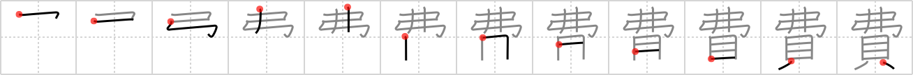

# {費}

## Strokes: 12

## Reading:

### On-Yomi: ヒ &mdash; Kun-Yomi: つい.やす、つい.える

### Examples: 費える (つい.える), 費やす (つい.やす)

## Words:

経費(けいひ): expenses, cost, outlay

光熱費(こうねつひ): cost of fuel and light

実費(じっぴ): actual expense, cost price

出費(しゅっぴ): expenses, disbursements

費やす(ついやす): to spend, to devote, to waste

費(ひ): cost, expense

浪費(ろうひ): waste, extravagance

消費(しょうひ): consumption, expenditure

費用(ひよう): cost, expense
